# 生产态 RAG 系统 — LLM 降级熔断设计方案

> 版本：v1.0 | 日期：2026-07-09
> 技术栈：Python + LangChain + Redis + Kubernetes
> 模型协议：OpenAI 兼容协议

---

## 目录

1. [设计目标与核心原则](#1-设计目标与核心原则)
2. [整体架构](#2-整体架构)
3. [模型注册与优先级体系](#3-模型注册与优先级体系)
4. [错误分类体系](#4-错误分类体系)
5. [分布式熔断器设计](#5-分布式熔断器设计)
6. [探针与自愈机制](#6-探针与自愈机制)
7. [降级路由引擎](#7-降级路由引擎)
8. [速率限制专项处理](#8-速率限制专项处理)
9. [错误特定策略矩阵](#9-错误特定策略矩阵)
10. [可观测性设计](#10-可观测性设计)
11. [Kubernetes 部署架构](#11-kubernetes-部署架构)
12. [配置示例](#12-配置示例)

---

## 1. 设计目标与核心原则

### 1.1 设计目标

| 目标 | 指标 | 说明 |
|------|------|------|
| **用户无感知切换** | 降级延迟 < 200ms | 模型故障时，用户端立即收到备选模型响应 |
| **故障自动恢复** | 恢复时间 < 30s | 模型恢复后自动切回，无需人工介入 |
| **错误精准分类** | 分类准确率 > 99% | 每类错误有专属处理策略，不错杀不遗漏 |
| **多实例一致性** | 状态同步延迟 < 1s | 所有 Pod 看到相同的熔断器状态 |
| **资源保护** | 不放大故障流量 | 熔断期间不向故障模型发送请求 |

### 1.2 核心原则

```
┌──────────────────────────────────────────────────────────────────┐
│                    五条核心原则                                    │
├──────────────────────────────────────────────────────────────────┤
│                                                                  │
│  原则 1: 错误即分类                                               │
│  → 每种错误都有"身份证"，分类决定了后续所有处理策略                │
│                                                                  │
│  原则 2: 降级即切换                                               │
│  → 故障模型立刻从候选池中移除，请求直接发给下一个可用模型          │
│                                                                  │
│  原则 3: 恢复即探针                                               │
│  → 故障模型不会永久禁用，用探针"敲门"确认恢复后重新加入             │
│                                                                  │
│  原则 4: 状态即共享                                               │
│  → 所有实例共享同一份熔断器状态，Redis 是唯一真相来源              │
│                                                                  │
│  原则 5: 可观测即底线                                             │
│  → 每次熔断、降级、恢复都产生指标和日志，运维必须可追溯            │
│                                                                  │
└──────────────────────────────────────────────────────────────────┘
```

---

## 2. 整体架构

### 2.1 多层防御体系

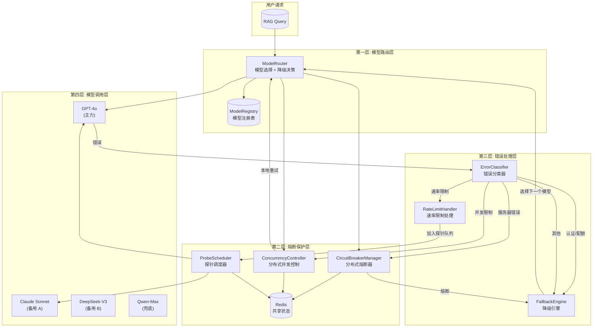
```mermaid
flowchart TB
    subgraph "用户请求"
        REQ[("RAG Query")]
    end

    subgraph "第一层: 模型路由层"
        ROUTER["ModelRouter\n模型选择 + 降级决策"]
        REGISTRY[("ModelRegistry\n模型注册表")]
    end

    subgraph "第二层: 熔断保护层"
        CB["CircuitBreakerManager\n分布式熔断器"]
        PROBE["ProbeScheduler\n探针调度器"]
        CONCUR["ConcurrencyController\n分布式并发控制"]
        REDIS[("Redis\n共享状态")]
    end

    subgraph "第三层: 错误处理层"
        CLASSIFIER["ErrorClassifier\n错误分类器"]
        RATE["RateLimitHandler\n速率限制处理"]
        FALLBACK["FallbackEngine\n降级引擎"]
    end

    subgraph "第四层: 模型调用层"
        M1["GPT-4o\n(主力)"]
        M2["Claude Sonnet\n(备用 A)"]
        M3["DeepSeek-V3\n(备用 B)"]
        M4["Qwen-Max\n(兜底)"]
    end

    REQ --> ROUTER
    ROUTER --> REGISTRY
    ROUTER --> CB
    ROUTER --> CONCUR
    CB --> REDIS
    CONCUR --> REDIS
    PROBE --> REDIS
    PROBE --> M1
    PROBE --> M2

    ROUTER --> M1
    M1 -->|"错误"| CLASSIFIER
    CLASSIFIER -->|"并发限制"| CONCUR
    CLASSIFIER -->|"速率限制"| RATE
    CLASSIFIER -->|"服务器错误"| CB
    CLASSIFIER -->|"认证/配额"| FALLBACK
    CLASSIFIER -->|"其他"| FALLBACK

    CB -->|"熔断"| FALLBACK
    CONCUR -->|"本地重试"| ROUTER
    RATE -->|"加入探针队列"| PROBE
    FALLBACK -->|"选择下一个模型"| ROUTER
```

### 2.2 组件关系与数据流

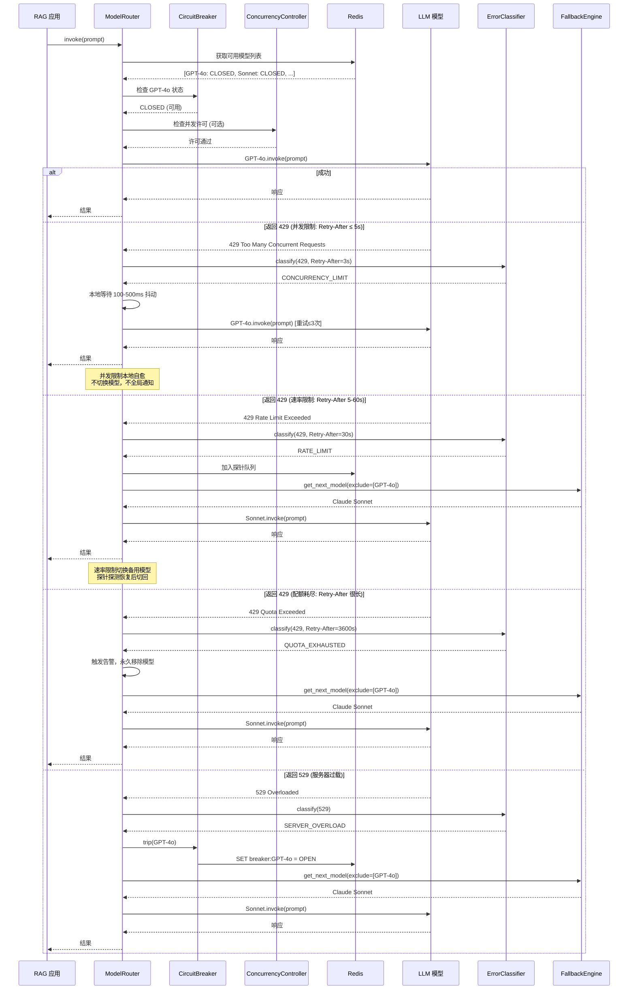
```mermaid
sequenceDiagram
    participant App as RAG 应用
    participant Router as ModelRouter
    participant CB as CircuitBreaker
    participant Concur as ConcurrencyController
    participant Redis as Redis
    participant LLM as LLM 模型
    participant Classifier as ErrorClassifier
    participant Fallback as FallbackEngine

    App->>Router: invoke(prompt)
    Router->>Redis: 获取可用模型列表
    Redis-->>Router: [GPT-4o: CLOSED, Sonnet: CLOSED, ...]
    Router->>CB: 检查 GPT-4o 状态
    CB-->>Router: CLOSED (可用)
    Router->>Concur: 检查并发许可 (可选)
    Concur-->>Router: 许可通过
    Router->>LLM: GPT-4o.invoke(prompt)

    alt 成功
        LLM-->>Router: 响应
        Router-->>App: 结果

    else 返回 429 (并发限制: Retry-After ≤ 5s)
        LLM-->>Router: 429 Too Many Concurrent Requests
        Router->>Classifier: classify(429, Retry-After=3s)
        Classifier-->>Router: CONCURRENCY_LIMIT
        Router->>Router: 本地等待 100-500ms 抖动
        Router->>LLM: GPT-4o.invoke(prompt) [重试≤3次]
        LLM-->>Router: 响应
        Router-->>App: 结果
        Note over Router: 并发限制本地自愈<br/>不切换模型，不全局通知

    else 返回 429 (速率限制: Retry-After 5-60s)
        LLM-->>Router: 429 Rate Limit Exceeded
        Router->>Classifier: classify(429, Retry-After=30s)
        Classifier-->>Router: RATE_LIMIT
        Router->>Redis: 加入探针队列
        Router->>Fallback: get_next_model(exclude=[GPT-4o])
        Fallback-->>Router: Claude Sonnet
        Router->>LLM: Sonnet.invoke(prompt)
        LLM-->>Router: 响应
        Router-->>App: 结果
        Note over Router: 速率限制切换备用模型<br/>探针探测恢复后切回

    else 返回 429 (配额耗尽: Retry-After 很长)
        LLM-->>Router: 429 Quota Exceeded
        Router->>Classifier: classify(429, Retry-After=3600s)
        Classifier-->>Router: QUOTA_EXHAUSTED
        Router->>Router: 触发告警，永久移除模型
        Router->>Fallback: get_next_model(exclude=[GPT-4o])
        Fallback-->>Router: Claude Sonnet
        Router->>LLM: Sonnet.invoke(prompt)
        LLM-->>Router: 响应
        Router-->>App: 结果

    else 返回 529 (服务器过载)
        LLM-->>Router: 529 Overloaded
        Router->>Classifier: classify(529)
        Classifier-->>Router: SERVER_OVERLOAD
        Router->>CB: trip(GPT-4o)
        CB->>Redis: SET breaker:GPT-4o = OPEN
        Router->>Fallback: get_next_model(exclude=[GPT-4o])
        Fallback-->>Router: Claude Sonnet
        Router->>LLM: Sonnet.invoke(prompt)
        LLM-->>Router: 响应
        Router-->>App: 结果
    end
```

---

## 3. 模型注册与优先级体系

### 3.1 模型分组策略

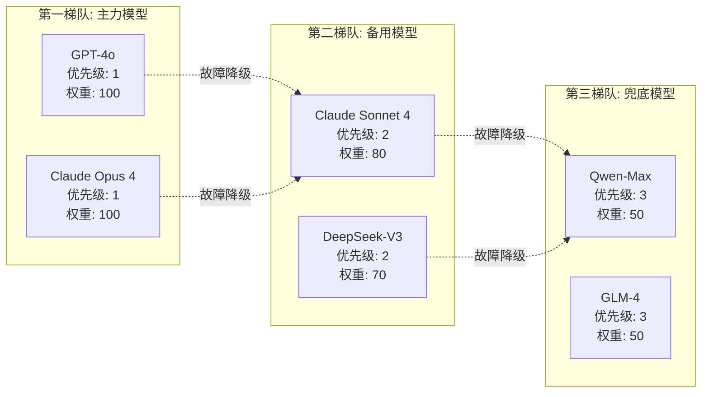
```mermaid
flowchart LR
    subgraph "第一梯队: 主力模型"
        P1["GPT-4o\n优先级: 1\n权重: 100"]
        P2["Claude Opus 4\n优先级: 1\n权重: 100"]
    end

    subgraph "第二梯队: 备用模型"
        B1["Claude Sonnet 4\n优先级: 2\n权重: 80"]
        B2["DeepSeek-V3\n优先级: 2\n权重: 70"]
    end

    subgraph "第三梯队: 兜底模型"
        F1["Qwen-Max\n优先级: 3\n权重: 50"]
        F2["GLM-4\n优先级: 3\n权重: 50"]
    end

    P1 -.->|"故障降级"| B1
    P2 -.->|"故障降级"| B1
    B1 -.->|"故障降级"| F1
    B2 -.->|"故障降级"| F1
```

### 3.2 模型配置结构

```yaml
# config/models.yaml
models:
  - id: "gpt-4o"
    name: "GPT-4o"
    provider: "openai"
    model_name: "gpt-4o"
    tier: "primary"           # primary | secondary | fallback
    priority: 1               # 越小越优先
    weight: 100               # 同优先级内的权重
    capabilities:
      max_tokens: 128000
      supports_function_calling: true
      supports_vision: true
      supports_json_mode: true
    endpoint:
      base_url: "https://api.openai.com/v1"
      api_key_env: "OPENAI_API_KEY"
    circuit_breaker:
      failure_threshold: 3          # 连续失败 N 次触发熔断
      success_threshold: 2          # 半开状态连续成功 N 次恢复
      timeout_seconds: 60           # 请求超时
      half_open_max_requests: 1     # 半开状态允许的最大请求数
      recovery_timeout_seconds: 30  # 熔断后多久进入半开状态
    concurrency:
      max_concurrent: 30            # 模型最大并发数 (供应商限额)
      local_retry_max: 3            # 并发 429 本地重试次数
      local_retry_jitter_ms: 500    # 重试抖动上限
      use_distributed_semaphore: false  # 是否启用 Redis 信号量 (由自动检测决定)
    rate_limit:
      max_requests_per_minute: 500
      max_tokens_per_minute: 200000
    retry:
      max_retries: 2               # 最大重试次数
      backoff_base_ms: 500         # 退避基准
      retryable_errors: ["RATE_LIMIT", "SERVER_OVERLOAD", "CONNECTION_ERROR"]

  - id: "claude-sonnet-4"
    name: "Claude Sonnet 4"
    provider: "anthropic"
    model_name: "claude-sonnet-4-6"
    tier: "secondary"
    priority: 2
    weight: 80
    capabilities:
      max_tokens: 200000
      supports_function_calling: true
      supports_vision: true
      supports_json_mode: false
    endpoint:
      base_url: "https://api.anthropic.com/v1"
      api_key_env: "ANTHROPIC_API_KEY"
    circuit_breaker:
      failure_threshold: 3
      success_threshold: 2
      timeout_seconds: 60
      half_open_max_requests: 1
      recovery_timeout_seconds: 30
    rate_limit:
      max_requests_per_minute: 200
      max_tokens_per_minute: 80000
    retry:
      max_retries: 2
      backoff_base_ms: 500
      retryable_errors: ["RATE_LIMIT", "SERVER_OVERLOAD", "CONNECTION_ERROR"]

  - id: "qwen-max"
    name: "Qwen-Max"
    provider: "openai_compatible"
    model_name: "qwen-max"
    tier: "fallback"
    priority: 3
    weight: 50
    capabilities:
      max_tokens: 32768
      supports_function_calling: true
      supports_vision: false
      supports_json_mode: false
    endpoint:
      base_url: "https://dashscope.aliyuncs.com/compatible-mode/v1"
      api_key_env: "DASHSCOPE_API_KEY"
    circuit_breaker:
      failure_threshold: 5          # 兜底模型容忍度更高
      success_threshold: 2
      timeout_seconds: 90
      half_open_max_requests: 1
      recovery_timeout_seconds: 60
    rate_limit:
      max_requests_per_minute: 100
      max_tokens_per_minute: 50000
    retry:
      max_retries: 3
      backoff_base_ms: 1000
      retryable_errors: ["RATE_LIMIT", "SERVER_OVERLOAD", "CONNECTION_ERROR"]
```

---

## 4. 错误分类体系

### 4.1 错误分类决策树

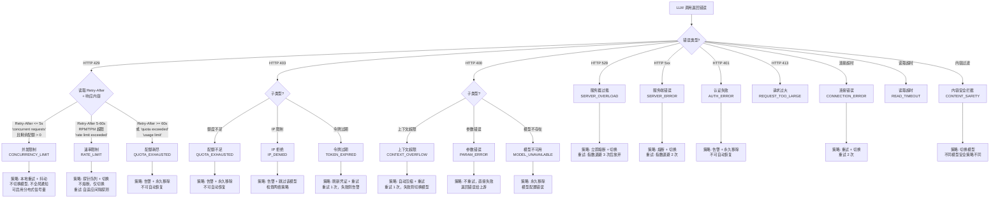
```mermaid
flowchart TD
    ERR["LLM 调用返回错误"] --> CHECK_TYPE{"错误类型?"}

    CHECK_TYPE -->|"HTTP 429"| RATE_429{"读取 Retry-After\n+ 响应内容"}
    CHECK_TYPE -->|"HTTP 529"| OVERLOAD["服务器过载\nSERVER_OVERLOAD"]
    CHECK_TYPE -->|"HTTP 5xx"| SVC_ERR["服务端错误\nSERVER_ERROR"]
    CHECK_TYPE -->|"HTTP 401"| AUTH["认证失败\nAUTH_ERROR"]
    CHECK_TYPE -->|"HTTP 403"| AUTH_FORBIDDEN{"子类型?"}
    CHECK_TYPE -->|"HTTP 400"| BAD_REQ{"子类型?"}
    CHECK_TYPE -->|"HTTP 413"| REQ_LARGE["请求过大\nREQUEST_TOO_LARGE"]
    CHECK_TYPE -->|"连接超时"| CONN["连接错误\nCONNECTION_ERROR"]
    CHECK_TYPE -->|"读取超时"| READ_TIMEOUT["读取超时\nREAD_TIMEOUT"]
    CHECK_TYPE -->|"内容过滤"| SAFETY["内容安全拦截\nCONTENT_SAFETY"]

    RATE_429 -->|"Retry-After <= 5s\n'concurrent requests'\n且剩余配额 > 0"| CONCUR["并发限制\nCONCURRENCY_LIMIT"]
    RATE_429 -->|"Retry-After 5-60s\nRPM/TPM 超限\n'rate limit exceeded'"| RATE["速率限制\nRATE_LIMIT"]
    RATE_429 -->|"Retry-After >= 60s\n或 'quota exceeded'\n'usage limit'"| QUOTA_429["配额耗尽\nQUOTA_EXHAUSTED"]

    AUTH_FORBIDDEN -->|"额度不足"| QUOTA["配额不足\nQUOTA_EXHAUSTED"]
    AUTH_FORBIDDEN -->|"IP 限制"| IP_DENY["IP 拒绝\nIP_DENIED"]
    AUTH_FORBIDDEN -->|"令牌过期"| TOKEN["令牌过期\nTOKEN_EXPIRED"]

    BAD_REQ -->|"上下文超限"| CTX["上下文超限\nCONTEXT_OVERFLOW"]
    BAD_REQ -->|"参数错误"| PARAM["参数错误\nPARAM_ERROR"]
    BAD_REQ -->|"模型不存在"| MODEL["模型不可用\nMODEL_UNAVAILABLE"]

    %% 策略分支
    CONCUR --> S0["策略: 本地重试 + 抖动\n不切换模型, 不全局通知\n可启用分布式信号量"]
    RATE --> S1["策略: 探针队列 + 切换\n不熔断，仅切换\n重试: 自适应间隔探测"]
    QUOTA_429 --> S5a["策略: 告警 + 永久移除\n不可自动恢复"]
    OVERLOAD --> S2["策略: 立即熔断 + 切换\n重试: 指数退避 3 次后放弃"]
    SVC_ERR --> S3["策略: 熔断 + 切换\n重试: 指数退避 2 次"]
    AUTH --> S4["策略: 告警 + 永久移除\n不可自动恢复"]
    QUOTA --> S5["策略: 告警 + 永久移除\n不可自动恢复"]
    TOKEN --> S6["策略: 刷新凭证 + 重试\n重试 1 次，失败则告警"]
    IP_DENY --> S7["策略: 告警 + 跳过该模型\n检查网络策略"]
    CTX --> S8["策略: 自动压缩 + 重试\n重试 1 次，失败则切换模型"]
    CONN --> S9["策略: 重试 + 切换\n重试 2 次"]
    SAFETY --> S10["策略: 切换模型\n不同模型安全策略不同"]
    PARAM --> S11["策略: 不重试，直接失败\n返回错误给上游"]
    MODEL --> S12["策略: 永久移除\n模型配置错误"]
```

### 4.2 错误分类枚举

| 错误类别 | 枚举值 | 是否自动恢复 | 处理策略 | 熔断行为 |
|---------|--------|-------------|---------|---------|
| 并发限制 | `CONCURRENCY_LIMIT` | 是（秒级） | 本地重试 + 抖动 3 次 | 不熔断，不切换模型 |
| 速率限制 | `RATE_LIMIT` | 是 | 探针队列 + 自适应探测 | 不熔断，切换模型 |
| 配额耗尽 | `QUOTA_EXHAUSTED` | 否 | 告警 + 永久移除 | 永久移除 |
| 服务器过载 | `SERVER_OVERLOAD` | 是 | 指数退避重试 3 次 | 连续 3 次 → 熔断 |
| 服务端错误 | `SERVER_ERROR` | 是 | 指数退避重试 2 次 | 连续 3 次 → 熔断 |
| 认证失败 | `AUTH_ERROR` | 否 | 告警 + 移除 | 永久移除 |
| 令牌过期 | `TOKEN_EXPIRED` | 是 | 刷新凭证 + 重试 1 次 | 重试失败 → 移除 |
| IP 拒绝 | `IP_DENIED` | 否 | 告警 + 跳过 | 永久移除 |
| 上下文超限 | `CONTEXT_OVERFLOW` | 是 | 自动压缩 + 重试 1 次 | 不熔断 |
| 请求过大 | `REQUEST_TOO_LARGE` | 否 | 不重试，直接失败 | 不熔断 |
| 参数错误 | `PARAM_ERROR` | 否 | 不重试，直接失败 | 不熔断 |
| 模型不可用 | `MODEL_UNAVAILABLE` | 否 | 永久移除 | 永久移除 |
| 连接错误 | `CONNECTION_ERROR` | 是 | 重试 2 次 | 连续 3 次 → 熔断 |
| 读取超时 | `READ_TIMEOUT` | 是 | 重试 2 次 | 连续 3 次 → 熔断 |
| 内容安全 | `CONTENT_SAFETY` | 是 | 切换模型重试 | 不熔断 |

### 4.3 429 三类区分：为什么不能一刀切

HTTP 429 是所有 LLM API 最常见的错误码，但**不同原因导致的 429 需要截然不同的处理策略**。

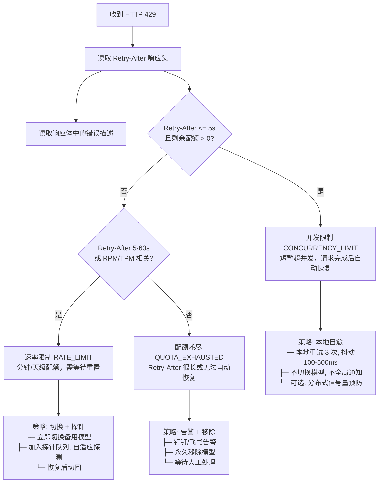
```mermaid
flowchart TD
    R429["收到 HTTP 429"] --> CHECK_HEADER["读取 Retry-After 响应头"]
    CHECK_HEADER --> CHECK_BODY["读取响应体中的错误描述"]

    CHECK_HEADER --> SHORT{"Retry-After <= 5s\n且剩余配额 > 0?"}
    SHORT -->|"是"| CONCUR["并发限制 CONCURRENCY_LIMIT\n短暂超并发，请求完成后自动恢复"]

    SHORT -->|"否"| MEDIUM{"Retry-After 5-60s\n或 RPM/TPM 相关?"}
    MEDIUM -->|"是"| RPM["速率限制 RATE_LIMIT\n分钟/天级配额，需等待重置"]

    MEDIUM -->|"否"| LONG["配额耗尽 QUOTA_EXHAUSTED\nRetry-After 很长或无法自动恢复"]

    CONCUR --> STRAT_CONCUR["策略: 本地自愈\n├─ 本地重试 3 次, 抖动 100-500ms\n├─ 不切换模型, 不全局通知\n└─ 可选: 分布式信号量预防"]
    RPM --> STRAT_RPM["策略: 切换 + 探针\n├─ 立即切换备用模型\n├─ 加入探针队列, 自适应探测\n└─ 恢复后切回"]
    LONG --> STRAT_LONG["策略: 告警 + 移除\n├─ 钉钉/飞书告警\n├─ 永久移除模型\n└─ 等待人工处理"]
```

**三类 429 的本质区别：**

| 维度 | 并发限制 | 速率限制 | 配额耗尽 |
|------|---------|---------|---------|
| 枚举值 | `CONCURRENCY_LIMIT` | `RATE_LIMIT` | `QUOTA_EXHAUSTED` |
| 触发条件 | 瞬时并发超过模型限制 | 超过了 RPM/TPM 限额 | 月度/日配额用完 |
| 自愈时间 | 秒级（请求完成即释放） | 分钟级（等待窗口重置） | 小时/天级（充值或等下月） |
| 是否切换模型 | **不切换** | 切换 | 切换 |
| 是否全局通知 | 否 | 否（仅探针） | 是（告警） |
| 典型 Retry-After | 1-5s | 5-60s | 3600s+ 或无 |
| 典型错误消息 | "Too many concurrent requests" | "Rate limit exceeded" | "Insufficient quota" |
| 能否本地自愈 | 能（等几秒即可） | 不能（需等待窗口重置） | 不能 |

**关键设计原则：**

```
并发限制是"瞬时"的、自愈的 → 本地静默处理，不污染全局状态
速率限制是"周期"的、有规律的 → 切换备用模型，探针探测恢复
配额耗尽是"永久"的（在充值前）→ 告警通知运维，模型下线
```

**并发限制的识别方法：**

```python
def classify_429(response) -> ErrorType:
    retry_after = int(response.headers.get("Retry-After", 0))
    body = response.json()
    error_msg = body.get("error", {}).get("message", "").lower()

    remaining_req = response.headers.get("x-ratelimit-remaining-requests")
    remaining_tok = response.headers.get("x-ratelimit-remaining-tokens")

    # 条件 1: 配额仍有剩余 → 不是配额问题
    quota_remaining = (remaining_req is None or int(remaining_req) > 0) and \
                      (remaining_tok is None or int(remaining_tok) > 0)

    # 条件 2: Retry-After 很短 → 不是速率限制
    if retry_after <= 5 and quota_remaining:
        return ErrorType.CONCURRENCY_LIMIT

    # 条件 3: 错误消息明确是并发
    if any(kw in error_msg for kw in ["concurrent", "parallel", "simultaneous"]):
        return ErrorType.CONCURRENCY_LIMIT

    if "quota" in error_msg or "insufficient" in error_msg:
        return ErrorType.QUOTA_EXHAUSTED

    return ErrorType.RATE_LIMIT
```

---

## 5. 分布式熔断器设计

### 5.1 三态机模型

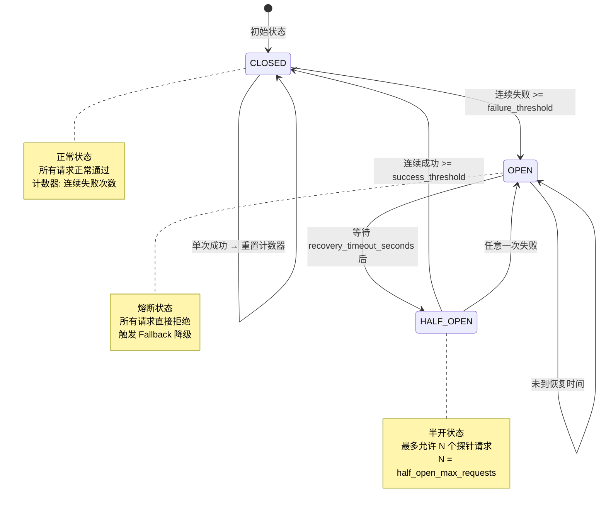
```mermaid
stateDiagram-v2
    [*] --> CLOSED: 初始状态

    CLOSED --> OPEN: 连续失败 >= failure_threshold
    CLOSED --> CLOSED: 单次成功 → 重置计数器

    OPEN --> HALF_OPEN: 等待 recovery_timeout_seconds 后
    OPEN --> OPEN: 未到恢复时间

    HALF_OPEN --> CLOSED: 连续成功 >= success_threshold
    HALF_OPEN --> OPEN: 任意一次失败

    note right of CLOSED
        正常状态
        所有请求正常通过
        计数器: 连续失败次数
    end note

    note right of OPEN
        熔断状态
        所有请求直接拒绝
        触发 Fallback 降级
    end note

    note right of HALF_OPEN
        半开状态
        最多允许 N 个探针请求
        N = half_open_max_requests
    end note
```

### 5.1.1 为什么需要 HALF_OPEN？（类比：电闸复位）

理解 HALF_OPEN 最好的方式是**电闸类比**：

```
家里电器短路 → 电闸跳了 (CLOSED → OPEN)
                  │
                  │ 你手动把电闸复位
                  ▼
              电闸复位了 (OPEN → HALF_OPEN)
                  │
                  │ 但你不确定短路是否修好了
                  │ 所以你只插一个台灯试试
                  ▼
         ┌── 台灯亮了 → 短路修好了 → 全部电器恢复 (HALF_OPEN → CLOSED)
         │
         └── 台灯又跳闸 → 短路还在 → 再次断开 (HALF_OPEN → OPEN)
```

**为什么不能直接 OPEN → CLOSED？**

| 如果直接 OPEN → CLOSED | 如果有 HALF_OPEN |
|---|---|
| 恢复时所有流量同时涌入 | 恢复时只有 1 个探针请求 |
| 如果模型还没恢复，**所有请求都失败** | 如果模型还没恢复，**只有 1 个请求失败** |
| 失败后再次熔断，大量请求已经受损 | 失败后立即回到 OPEN，不影响其他请求 |
| 可能出现"开-关-开-关"振荡（flapping） | 通过 success_threshold 确认稳定后才恢复 |

**HALF_OPEN 与后台探针的区别：**

```
┌─────────────────────────────────────────────────────────────────┐
│                    两种探测机制对比                               │
├──────────────────┬──────────────────┬───────────────────────────┤
│   HALF_OPEN 探针  │   后台探针调度器    │  说明                      │
│  (同步, 被动)     │  (异步, 主动)      │                           │
├──────────────────┼──────────────────┼───────────────────────────┤
│ 由用户请求触发    │ 定时器主动触发     │ 触发方式不同               │
│ 使用用户真实请求  │ 使用轻量测试 prompt │ 探针内容不同             │
│ 失败只影响 1 个用户│ 失败不影响用户     │ 影响范围不同              │
│ 用于熔断器状态转换 │ 用于速率限制恢复探测│ 目的不同                  │
│ 决定 OPEN→CLOSED  │ 决定能否从探针队列移除│ 决策不同               │
└──────────────────┴──────────────────┴───────────────────────────┘
```

**HALF_OPEN 的实际行为：** 假设 3 个 Pod，`half_open_max_requests = 1`：

```
Pod-1: 用户请求到达 → 状态是 HALF_OPEN → 尝试获取探针许可
       → DECR half_open_permits: 1 → 0 (获取成功)
       → 用真实用户请求调用模型
       → 成功 → INCR half_open_successes → 达到 2 → 切换 CLOSED

Pod-2: 同时有用户请求到达 → 状态是 HALF_OPEN → 尝试获取探针许可
       → GET half_open_permits: 0 (无许可!)
       → 拒绝请求 → 触发 Fallback 降级到备用模型

Pod-3: 同上，被拒绝，降级到备用模型
```

**所以回答你的问题：是的，HALF_OPEN 状态只有极少量请求（由 `half_open_max_requests` 控制，通常为 1）会使用故障模型，其余请求全部降级到备用模型。** 这是一种"牺牲一个请求来验证模型是否恢复"的策略——代价极小，收益极大。

### 5.1.2 三态转换的时间线示例

```mermaid
gantt
    title 熔断器三态转换时间线 (GPT-4o 为例)
    dateFormat HH:mm:ss
    axisFormat %H:%M:%S

    section 模型状态
    CLOSED 正常     :done, s1, 00:00:00, 10s
    OPEN 熔断       :crit, s2, 00:00:10, 30s
    HALF_OPEN 探测  :active, s3, 00:00:40, 5s
    CLOSED 恢复     :done, s4, 00:00:45, 15s

    section 流量
    全部通过        :done, t1, 00:00:00, 10s
    全部拒绝(降级)  :crit, t2, 00:00:10, 30s
    仅1个探针      :active, t3, 00:00:40, 5s
    全部通过        :done, t4, 00:00:45, 15s

    section 事件
    第3次连续失败   :milestone, m1, 00:00:10
    recovery_timeout到期 :milestone, m2, 00:00:40
    探针成功+确认   :milestone, m3, 00:00:45
```

**时间线解读：**

```
00:00:00 ─ 模型正常运行 (CLOSED)，所有流量通过
00:00:03 ─ 第 1 次 529 失败，计数器 = 1
00:00:06 ─ 第 2 次 529 失败，计数器 = 2
00:00:10 ─ 第 3 次 529 失败，计数器 = 3 → 触发熔断
          状态切换为 OPEN
          所有新请求直接降级到备用模型
          设置 recovery_timeout = 30s

00:00:40 ─ recovery_timeout 到期
          状态从 OPEN 自动切换为 HALF_OPEN
          释放 half_open_max_requests = 1 个探针许可

00:00:41 ─ Pod-1 收到用户请求
          状态为 HALF_OPEN，获取到探针许可
          用真实请求调用 GPT-4o → 成功!
          half_open_successes = 1 (还需 1 次确认)

00:00:43 ─ Pod-2 收到用户请求
          状态为 HALF_OPEN，但无探针许可
          降级到备用模型

00:00:45 ─ Pod-1 又收到用户请求
          状态为 HALF_OPEN，获取到探针许可
          用真实请求调用 GPT-4o → 成功!
          half_open_successes = 2 → 达到 success_threshold
          状态切换为 CLOSED，所有流量恢复
```

### 5.2 Redis 数据结构设计

```
# 熔断器状态
Key:   breaker:{model_id}:state
Value: "CLOSED" | "OPEN" | "HALF_OPEN"
TTL:   recovery_timeout_seconds (仅在 OPEN 状态设置)

# 失败计数器
Key:   breaker:{model_id}:failures
Value: 整数 (连续失败次数)
TTL:   无 (CLOSED 状态下重置为 0 时删除)

# 半开状态成功计数器
Key:   breaker:{model_id}:half_open_successes
Value: 整数
TTL:   60s (防止泄漏)

# 半开状态请求许可 (信号量)
Key:   breaker:{model_id}:half_open_permits
Value: 整数 (剩余允许的探针请求数)
TTL:   60s

# 分布式锁 (用于原子状态转换)
Key:   breaker:{model_id}:lock
Value: 实例 ID
TTL:   5s (防止死锁)
```

### 5.3 原子状态转换流程

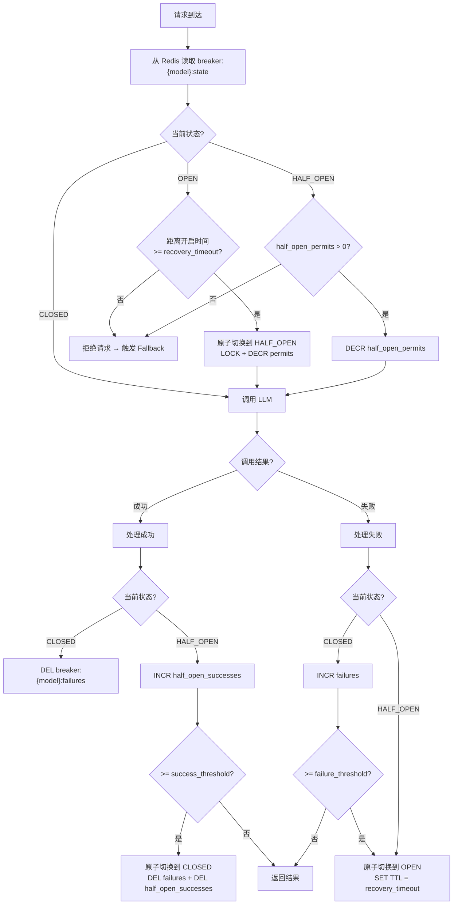
```mermaid
flowchart TD
    START["请求到达"] --> GET_STATE["从 Redis 读取 breaker:{model}:state"]

    GET_STATE --> STATE{"当前状态?"}

    STATE -->|"CLOSED"| CALL["调用 LLM"]
    STATE -->|"OPEN"| CHECK_TIME{"距离开启时间\n>= recovery_timeout?"}
    STATE -->|"HALF_OPEN"| CHECK_PERMIT{"half_open_permits > 0?"}

    CHECK_TIME -->|"是"| ATOMIC_SWITCH["原子切换到 HALF_OPEN\nLOCK + DECR permits"]
    CHECK_TIME -->|"否"| REJECT["拒绝请求 → 触发 Fallback"]

    ATOMIC_SWITCH --> CALL

    CHECK_PERMIT -->|"是"| DECR["DECR half_open_permits"]
    CHECK_PERMIT -->|"否"| REJECT
    DECR --> CALL

    CALL --> RESULT{"调用结果?"}

    RESULT -->|"成功"| ON_SUCCESS["处理成功"]
    RESULT -->|"失败"| ON_FAILURE["处理失败"]

    ON_SUCCESS --> SUCC_STATE{"当前状态?"}
    SUCC_STATE -->|"CLOSED"| RESET_FAIL["DEL breaker:{model}:failures"]
    SUCC_STATE -->|"HALF_OPEN"| INCR_SUCC["INCR half_open_successes"]
    INCR_SUCC --> CHECK_SUCC{">= success_threshold?"}
    CHECK_SUCC -->|"是"| TO_CLOSED["原子切换到 CLOSED\nDEL failures + DEL half_open_successes"]
    CHECK_SUCC -->|"否"| DONE["返回结果"]

    ON_FAILURE --> FAIL_STATE{"当前状态?"}
    FAIL_STATE -->|"CLOSED"| INCR_FAIL["INCR failures"]
    INCR_FAIL --> CHECK_FAIL{">= failure_threshold?"}
    CHECK_FAIL -->|"是"| TO_OPEN["原子切换到 OPEN\nSET TTL = recovery_timeout"]
    CHECK_FAIL -->|"否"| DONE
    FAIL_STATE -->|"HALF_OPEN"| TO_OPEN
```

### 5.4 多实例一致性保证

核心问题：多个 Pod 同时看到熔断器为 CLOSED，同时决定将其切换为 OPEN。

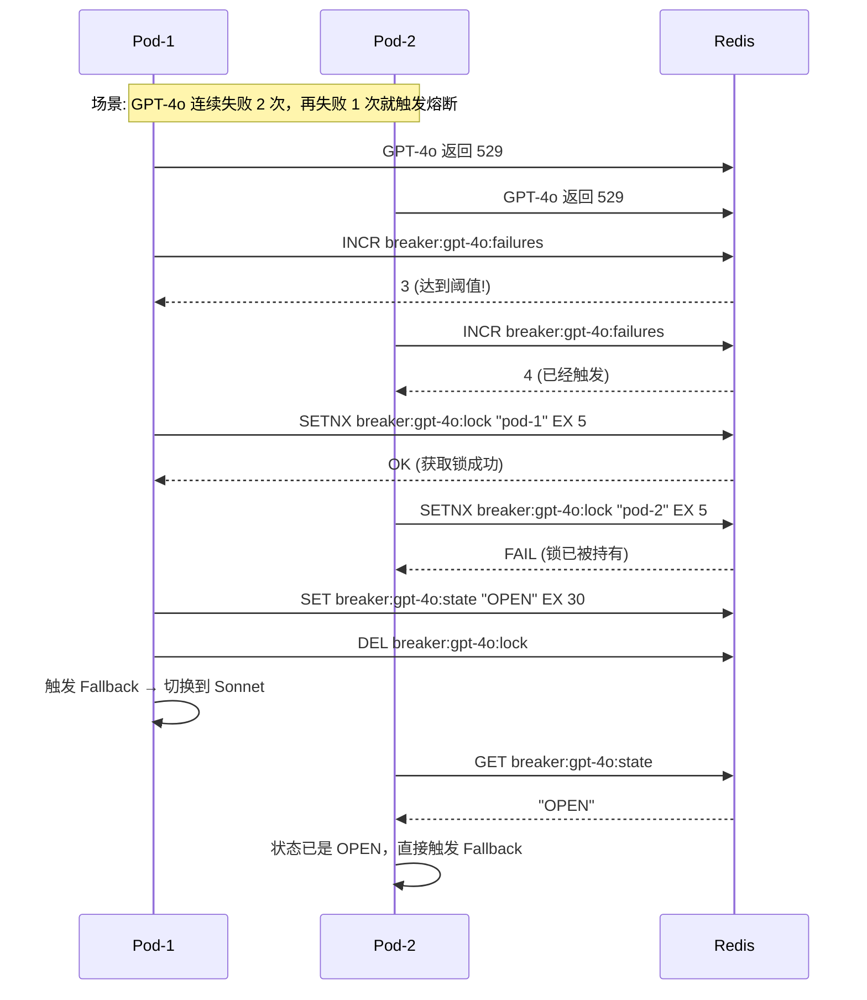
```mermaid
sequenceDiagram
    participant P1 as Pod-1
    participant P2 as Pod-2
    participant Redis as Redis

    Note over P1,P2: 场景: GPT-4o 连续失败 2 次，再失败 1 次就触发熔断

    P1->>Redis: GPT-4o 返回 529
    P2->>Redis: GPT-4o 返回 529

    P1->>Redis: INCR breaker:gpt-4o:failures
    Redis-->>P1: 3 (达到阈值!)

    P2->>Redis: INCR breaker:gpt-4o:failures
    Redis-->>P2: 4 (已经触发)

    P1->>Redis: SETNX breaker:gpt-4o:lock "pod-1" EX 5
    Redis-->>P1: OK (获取锁成功)

    P2->>Redis: SETNX breaker:gpt-4o:lock "pod-2" EX 5
    Redis-->>P2: FAIL (锁已被持有)

    P1->>Redis: SET breaker:gpt-4o:state "OPEN" EX 30
    P1->>Redis: DEL breaker:gpt-4o:lock
    P1->>P1: 触发 Fallback → 切换到 Sonnet

    P2->>Redis: GET breaker:gpt-4o:state
    Redis-->>P2: "OPEN"
    P2->>P2: 状态已是 OPEN，直接触发 Fallback
```

**一致性要点：**

1. **状态读写分离**：INCR 计数器无锁，SET 状态需锁——只有在需要切换状态时才加锁
2. **SETNX 短 TTL**：锁 TTL = 5 秒，即使 Pod 崩溃也不会死锁
3. **状态检查优先**：每次请求前先读状态，避免不必要的计数器操作
4. **最终一致性**：极端情况下可能有 1 个请求的"穿透窗口"，但不会导致状态错乱

---

## 6. 探针与自愈机制

### 6.1 探针生命周期

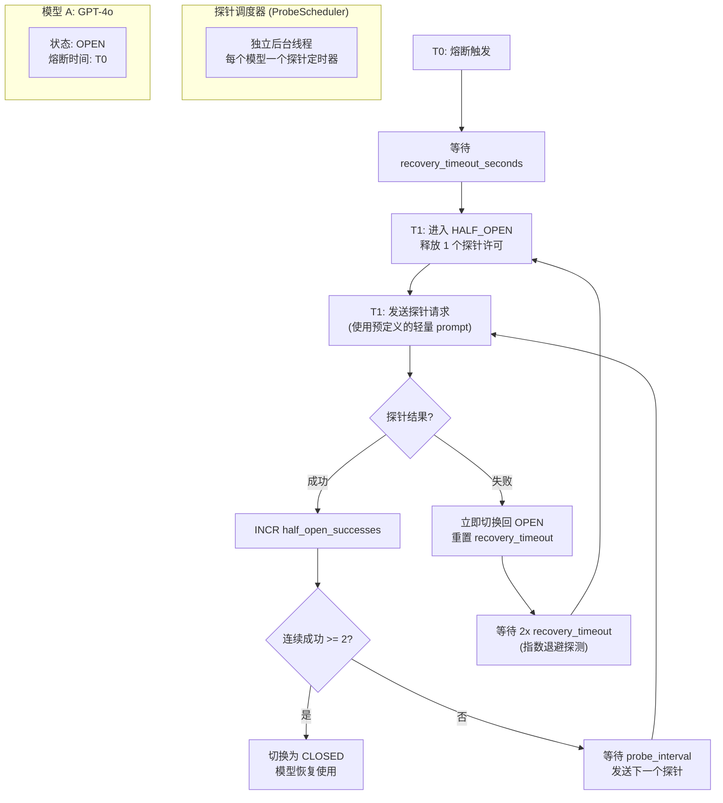
```mermaid
flowchart TD
    subgraph "探针调度器 (ProbeScheduler)"
        SCHED["独立后台线程\n每个模型一个探针定时器"]
    end

    subgraph "模型 A: GPT-4o"
        M_A["状态: OPEN\n熔断时间: T0"]
    end

    T0["T0: 熔断触发"] --> WAIT["等待 recovery_timeout_seconds"]
    WAIT --> HALF["T1: 进入 HALF_OPEN\n释放 1 个探针许可"]
    HALF --> PROBE_REQ["T1: 发送探针请求\n(使用预定义的轻量 prompt)"]

    PROBE_REQ --> PROBE_RES{"探针结果?"}

    PROBE_RES -->|"成功"| SUCC["INCR half_open_successes"]
    SUCC --> CHECK_N{"连续成功 >= 2?"}
    CHECK_N -->|"是"| CLOSED["切换为 CLOSED\n模型恢复使用"]
    CHECK_N -->|"否"| NEXT_PROBE["等待 probe_interval\n发送下一个探针"]

    PROBE_RES -->|"失败"| FAIL["立即切换回 OPEN\n重置 recovery_timeout"]
    FAIL --> WAIT2["等待 2x recovery_timeout\n(指数退避探测)"]

    NEXT_PROBE --> PROBE_REQ
    WAIT2 --> HALF
```

### 6.2 探针参数

| 参数 | 默认值 | 说明 |
|------|--------|------|
| `probe_interval_initial` | 5s | 第一次探针间隔 |
| `probe_interval_max` | 60s | 最大探针间隔 |
| `probe_interval_multiplier` | 2.0 | 探针失败后间隔倍增因子 |
| `probe_prompt` | `"Hello, respond with 'OK'."` | 探针使用的轻量 prompt |
| `probe_max_tokens` | 10 | 探针最大返回 token 数 |
| `probe_timeout` | 10s | 探针请求超时 |

### 6.3 速率限制探针队列（特殊处理）

速率限制**不是故障**，所以不触发熔断，而是用探针队列：

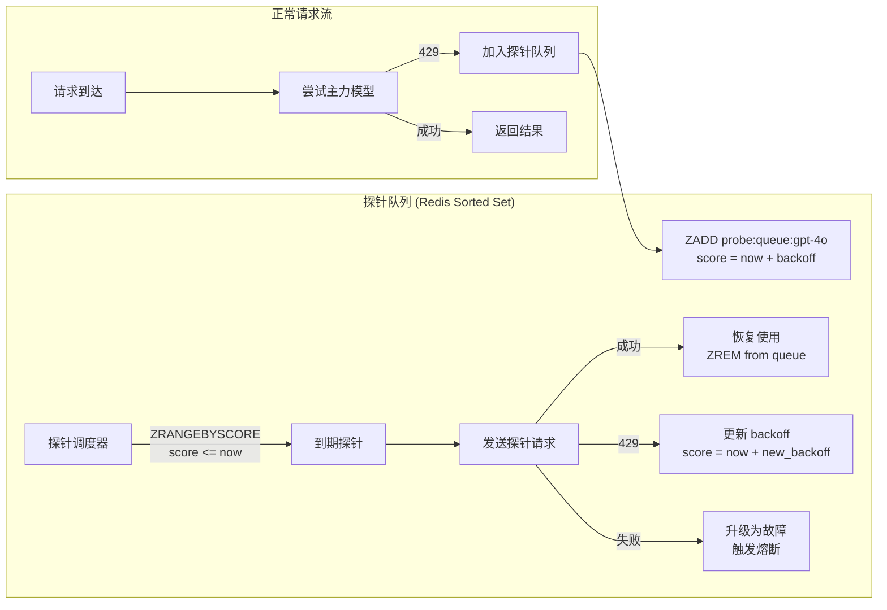
```mermaid
flowchart LR
    subgraph "正常请求流"
        REQ["请求到达"] --> TRY["尝试主力模型"]
        TRY -->|"429"| QUEUE["加入探针队列"]
        TRY -->|"成功"| DONE["返回结果"]
    end

    subgraph "探针队列 (Redis Sorted Set)"
        QUEUE --> REDIS_Q["ZADD probe:queue:gpt-4o\nscore = now + backoff"]
        SCHED["探针调度器"] -->|"ZRANGEBYSCORE\nscore <= now"| DUE["到期探针"]
        DUE --> PROBE["发送探针请求"]
        PROBE -->|"成功"| RECOVER["恢复使用\nZREM from queue"]
        PROBE -->|"429"| BACKOFF["更新 backoff\nscore = now + new_backoff"]
        PROBE -->|"失败"| CB_TRIP["升级为故障\n触发熔断"]
    end
```

**速率限制探针的退避策略：**

```
第 1 次 429: 等待 1s 后首次探针
第 2 次 429: 等待 2s 后探针
第 3 次 429: 等待 4s 后探针
第 N 次 429: 等待 min(2^N, 30s) 后探针
成功恢复: 重置 backoff 为 1s
```

---

## 7. 降级路由引擎

### 7.1 降级决策流程

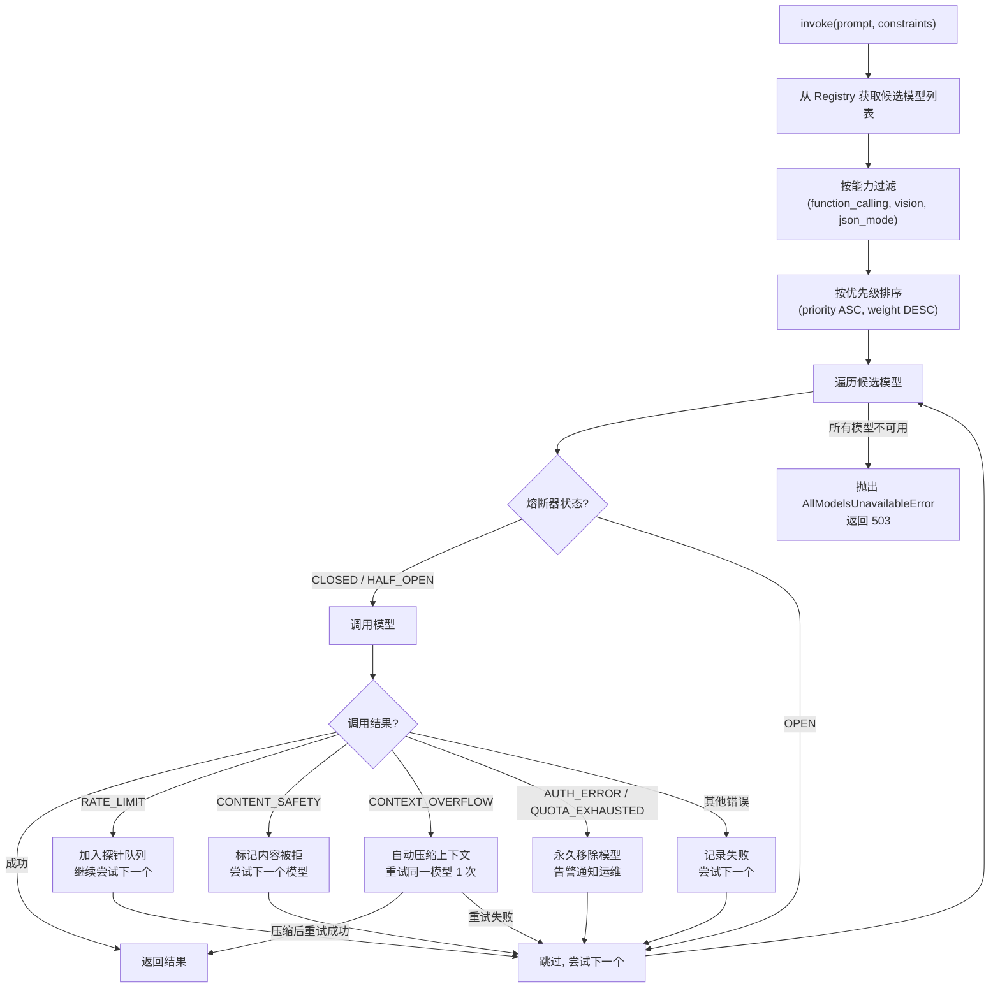
```mermaid
flowchart TD
    REQ["invoke(prompt, constraints)"] --> FILTER["从 Registry 获取候选模型列表"]

    FILTER --> FILTER_CAPS["按能力过滤\n(function_calling, vision, json_mode)"]
    FILTER_CAPS --> SORT["按优先级排序\n(priority ASC, weight DESC)"]

    SORT --> LOOP["遍历候选模型"]

    LOOP --> CHECK_CB{"熔断器状态?"}
    CHECK_CB -->|"CLOSED / HALF_OPEN"| CALL["调用模型"]
    CHECK_CB -->|"OPEN"| NEXT["跳过, 尝试下一个"]

    CALL --> CALL_RES{"调用结果?"}

    CALL_RES -->|"成功"| RETURN["返回结果"]
    CALL_RES -->|"RATE_LIMIT"| RATE_HANDLER["加入探针队列\n继续尝试下一个"]
    CALL_RES -->|"CONTENT_SAFETY"| SAFETY_HANDLER["标记内容被拒\n尝试下一个模型"]
    CALL_RES -->|"CONTEXT_OVERFLOW"| CTX_HANDLER["自动压缩上下文\n重试同一模型 1 次"]
    CALL_RES -->|"AUTH_ERROR / QUOTA_EXHAUSTED"| PERM_REMOVE["永久移除模型\n告警通知运维"]
    CALL_RES -->|"其他错误"| ERR_HANDLER["记录失败\n尝试下一个"]

    RATE_HANDLER --> NEXT
    SAFETY_HANDLER --> NEXT
    CTX_HANDLER -->|"压缩后重试成功"| RETURN
    CTX_HANDLER -->|"重试失败"| NEXT
    PERM_REMOVE --> NEXT
    ERR_HANDLER --> NEXT

    NEXT --> LOOP

    LOOP -->|"所有模型不可用"| ALL_FAIL["抛出 AllModelsUnavailableError\n返回 503"]
```

### 7.2 降级策略矩阵

| 场景 | 当前模型 | 降级目标 | 切换延迟 | 是否重试当前模型 |
|------|---------|---------|---------|----------------|
| 速率限制 (429) | GPT-4o | Claude Sonnet | 即时 | 否（探针后台探测） |
| 服务器过载 (529) | GPT-4o | Claude Sonnet | 即时 | 是（3 次指数退避） |
| 5xx 错误 | 任意 | 下一个同优先级 | 即时 | 是（2 次） |
| 连接超时 | 任意 | 下一个同优先级 | 即时 | 是（2 次） |
| 上下文超限 | 任意 | 下一个更大上下文模型 | 压缩后重试 | 是（1 次） |
| 内容安全 | GPT-4o | Claude Sonnet | 即时 | 否 |
| 认证失败 | 任意 | 下一个 | 即时 | 否（永久移除） |
| 配额不足 | 任意 | 下一个 | 即时 | 否（永久移除） |
| 主力全部故障 | 主力 | 备用 | 即时 | — |
| 备用全部故障 | 备用 | 兜底 | 即时 | — |
| 全部故障 | — | — | — | 503 + 告警 |

---

## 8. 速率限制专项处理

### 8.1 速率限制的特殊性

速率限制与其他错误有本质区别：

| 特性 | 速率限制 (429) | 服务器过载 (529) |
|------|---------------|-----------------|
| **含义** | "你太快了，等等" | "我坏了，别来了" |
| **是否应熔断** | 否——模型本身正常 | 是——模型可能故障 |
| **恢复策略** | 探针确认恢复 | 等待 + 半开验证 |
| **流量控制** | 自适应降速 | 完全切断 |
| **降级行为** | 立即切换，后台探测 | 熔断后切换 |

### 8.2 自适应速率控制

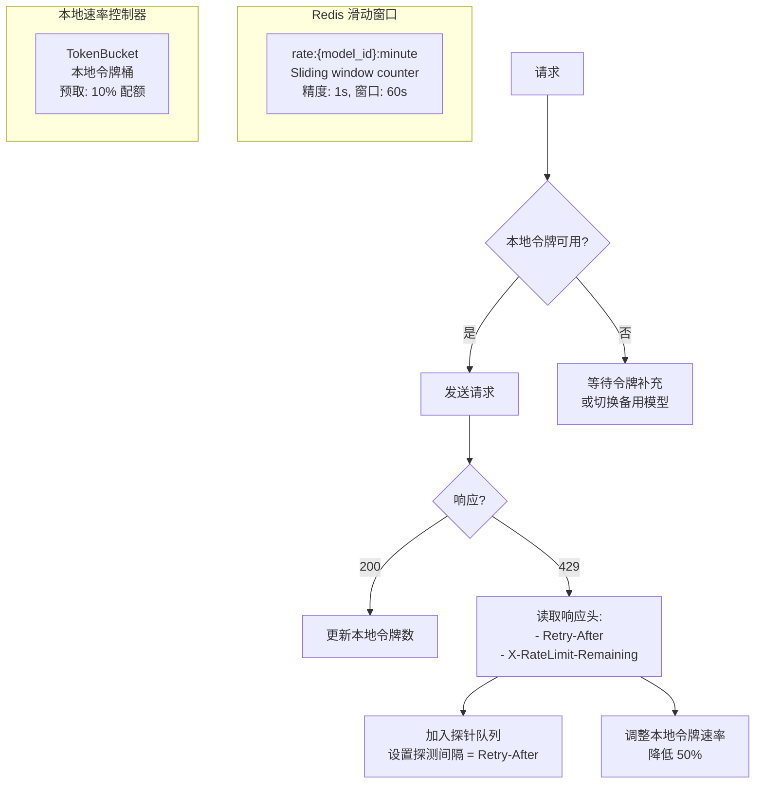
```mermaid
flowchart TD
    subgraph "Redis 滑动窗口"
        WINDOW["rate:{model_id}:minute\nSliding window counter\n精度: 1s, 窗口: 60s"]
    end

    subgraph "本地速率控制器"
        LOCAL["TokenBucket\n本地令牌桶\n预取: 10% 配额"]
    end

    REQ["请求"] --> LOCAL_CHECK{"本地令牌可用?"}
    LOCAL_CHECK -->|"是"| SEND["发送请求"]
    LOCAL_CHECK -->|"否"| WAIT["等待令牌补充\n或切换备用模型"]

    SEND --> RESULT{"响应?"}
    RESULT -->|"200"| UPDATE["更新本地令牌数"]
    RESULT -->|"429"| READ_HEADERS["读取响应头:\n- Retry-After\n- X-RateLimit-Remaining"]

    READ_HEADERS --> QUEUE_PROBE["加入探针队列\n设置探测间隔 = Retry-After"]
    READ_HEADERS --> ADJUST["调整本地令牌速率\n降低 50%"]
```

### 8.3 探针队列的 Redis 实现

```
# 探针队列: 按下次探测时间排序
Key: probe:queue:{model_id}
Type: Sorted Set
Score: 下次探测时间戳 (ms)
Member: 探针请求 ID

# 添加探针
ZADD probe:queue:gpt-4o {next_probe_timestamp} "probe:{uuid}"

# 获取到期探针 (需要探测的)
ZRANGEBYSCORE probe:queue:gpt-4o 0 {now_timestamp} LIMIT 0 1

# 移除已处理的探针
ZREM probe:queue:gpt-4o "probe:{uuid}"

# 探针成功 → 从队列中移除全部探针 (模型恢复)
DEL probe:queue:gpt-4o

# 探针仍 429 → 更新探测时间
ZADD probe:queue:gpt-4o {new_timestamp} "probe:{uuid}"
```

### 8.4 分布式并发控制（预防并发 429）

**为什么需要分布式并发控制？** 即使并发 429 可以本地重试自愈，但如果每次请求都因超并发而被拒绝再重试，会增加不必要的延迟。更好的做法是**在请求发出前就避免超过并发上限**，从源头减少 429。

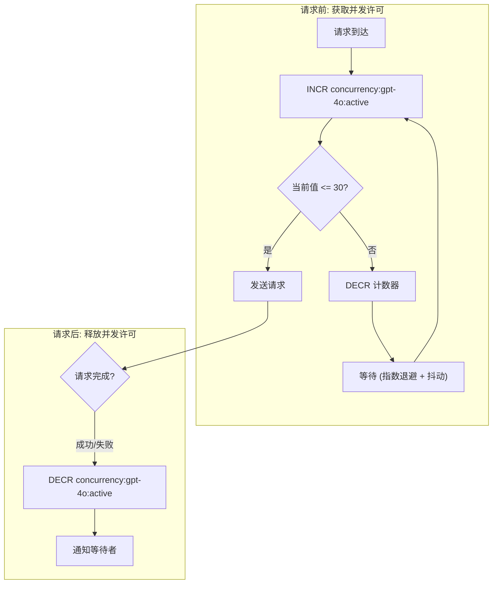
```mermaid
flowchart TD
    subgraph "请求前: 获取并发许可"
        A["请求到达"] --> B["INCR concurrency:gpt-4o:active"]
        B --> C{"当前值 <= 30?"}
        C -->|"是"| D["发送请求"]
        C -->|"否"| E["DECR 计数器"]
        E --> F["等待 (指数退避 + 抖动)"]
        F --> B
    end

    subgraph "请求后: 释放并发许可"
        D --> G{"请求完成?"}
        G -->|"成功/失败"| H["DECR concurrency:gpt-4o:active"]
        H --> I["通知等待者"]
    end
```

**Redis 分布式信号量设计：**

```
# 当前活跃请求数 (原子计数器)
Key:   concurrency:{model_id}:active
Value: 整数 (当前正在执行的请求数)
操作:  INCR (请求前) / DECR (请求后)
TTL:   60s (防止泄漏——如果进程崩溃，计数器不会永久增加)

# 并发限制配置
Key:   concurrency:{model_id}:max
Value: 整数 (如 30)
来源: 模型配置的 max_concurrency 字段

# 等待队列 (可选用，用于公平调度)
Key:   concurrency:{model_id}:wait_queue
Type:  List (FIFO)
```

**本地并发控制的二级架构：**

```
┌─────────────────────────────────────────────────────────────────┐
│                    并发控制双层架构                               │
├─────────────────────────────────────────────────────────────────┤
│                                                                 │
│  第一层: 本地令牌桶 (每个 Pod 独立)                              │
│  ┌─────────────────────────────────────────────────────────┐   │
│  │ 总并发 = 30, 3 个 Pod                                    │   │
│  │ 每个 Pod 本地令牌 = 30 / 3 = 10 (可配置倍数)              │   │
│  │ 本地令牌用完 → 等待本地补充，不跨网络                      │   │
│  │ 优点: 零网络开销，纳秒级判断                               │   │
│  └─────────────────────────────────────────────────────────┘   │
│                          │                                      │
│                          │ 本地令牌不足时，向 Redis 申请         │
│                          ▼                                      │
│  第二层: Redis 全局信号量 (跨 Pod 协调)                          │
│  ┌─────────────────────────────────────────────────────────┐   │
│  │ INCR concurrency:{model}:active                          │   │
│  │ 超过 max → DECR + 等待 + 重试                            │   │
│  │ 优点: 全局精确控制，防止整体超限                           │   │
│  └─────────────────────────────────────────────────────────┘   │
│                                                                 │
└─────────────────────────────────────────────────────────────────┘
```

**两种模式的权衡：**

| 模式 | 适用场景 | 优点 | 缺点 |
|------|---------|------|------|
| **纯本地重试**（推荐默认） | 并发限制较宽松 (>50) | 零网络开销，简单 | 偶发 429，增加 100-500ms 延迟 |
| **Redis 信号量** | 并发限制严格 (<=30) | 几乎零 429 | 每次请求多 1-2ms Redis 往返 |

**推荐策略：** 默认使用纯本地重试（轻量）。如果观测到某模型的并发 429 比例 > 5%，自动为该模型启用 Redis 信号量模式。

---

## 9. 错误特定策略矩阵

### 9.1 API Key 没钱 / 配额不足

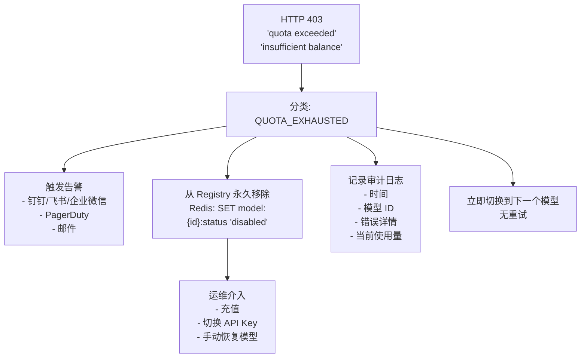
```mermaid
flowchart TD
    ERR_QUOTA["HTTP 403\n'quota exceeded'\n'insufficient balance'"] --> CLASSIFY["分类: QUOTA_EXHAUSTED"]

    CLASSIFY --> ALERT["触发告警\n- 钉钉/飞书/企业微信\n- PagerDuty\n- 邮件"]

    CLASSIFY --> REMOVE["从 Registry 永久移除\nRedis: SET model:{id}:status 'disabled'"]

    CLASSIFY --> LOG["记录审计日志\n- 时间\n- 模型 ID\n- 错误详情\n- 当前使用量"]

    CLASSIFY --> SWITCH["立即切换到下一个模型\n无重试"]

    REMOVE --> OPS["运维介入\n- 充值\n- 切换 API Key\n- 手动恢复模型"]
```

### 9.2 鉴权失败

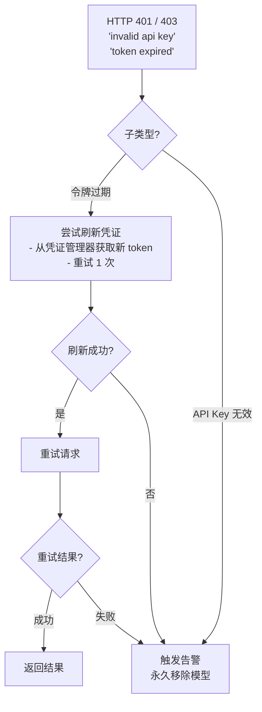
```mermaid
flowchart TD
    ERR_AUTH["HTTP 401 / 403\n'invalid api key'\n'token expired'"] --> CLASSIFY{"子类型?"}

    CLASSIFY -->|"令牌过期"| REFRESH["尝试刷新凭证\n- 从凭证管理器获取新 token\n- 重试 1 次"]
    CLASSIFY -->|"API Key 无效"| ALERT["触发告警\n永久移除模型"]

    REFRESH --> REFRESH_RES{"刷新成功?"}
    REFRESH_RES -->|"是"| RETRY["重试请求"]
    REFRESH_RES -->|"否"| ALERT

    RETRY --> RETRY_RES{"重试结果?"}
    RETRY_RES -->|"成功"| DONE["返回结果"]
    RETRY_RES -->|"失败"| ALERT
```

### 9.3 上下文超限

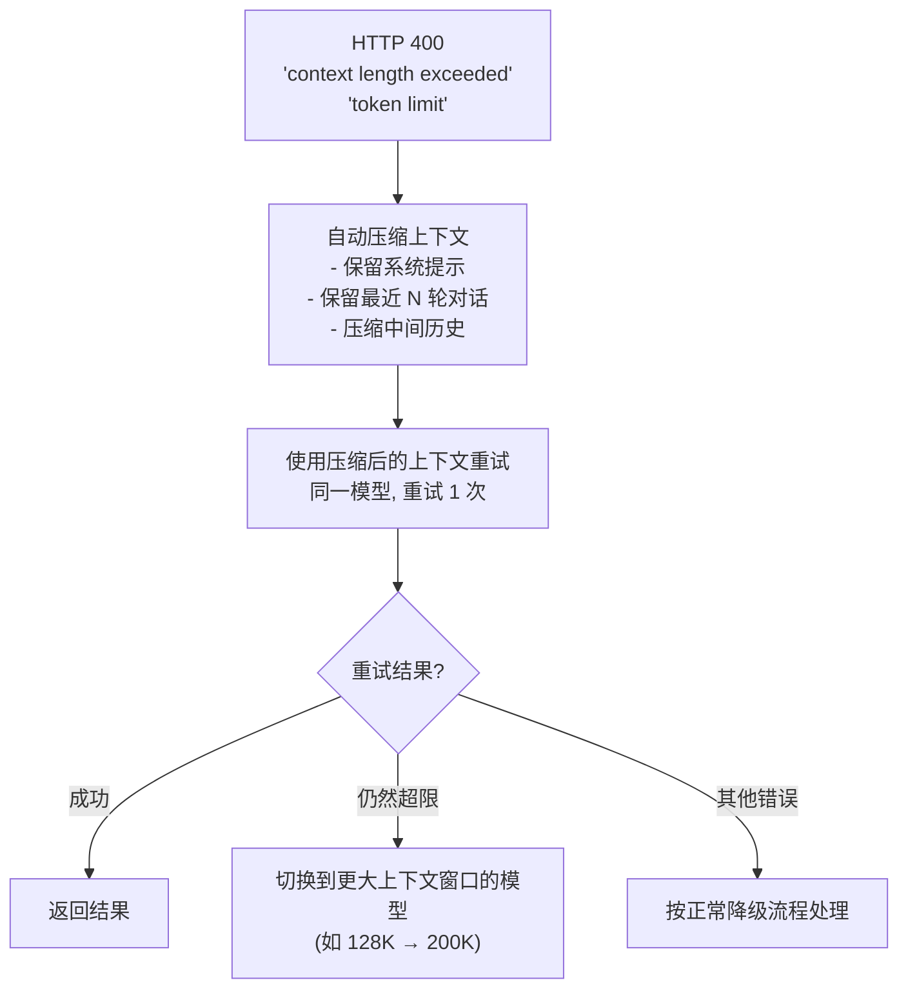
```mermaid
flowchart TD
    ERR_CTX["HTTP 400\n'context length exceeded'\n'token limit'"] --> COMPACT["自动压缩上下文\n- 保留系统提示\n- 保留最近 N 轮对话\n- 压缩中间历史"]

    COMPACT --> RETRY["使用压缩后的上下文重试\n同一模型, 重试 1 次"]

    RETRY --> RETRY_RES{"重试结果?"}
    RETRY_RES -->|"成功"| DONE["返回结果"]
    RETRY_RES -->|"仍然超限"| SWITCH["切换到更大上下文窗口的模型\n(如 128K → 200K)"]
    RETRY_RES -->|"其他错误"| FALLBACK["按正常降级流程处理"]
```

### 9.4 内容安全拦截

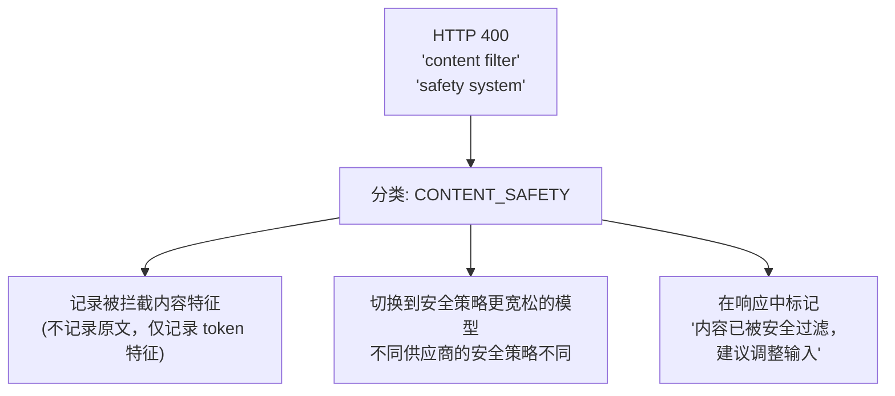
```mermaid
flowchart TD
    ERR_SAFETY["HTTP 400\n'content filter'\n'safety system'"] --> CLASSIFY["分类: CONTENT_SAFETY"]

    CLASSIFY --> LOG["记录被拦截内容特征\n(不记录原文，仅记录 token 特征)"]

    CLASSIFY --> SWITCH["切换到安全策略更宽松的模型\n不同供应商的安全策略不同"]

    CLASSIFY --> NOTE["在响应中标记\n'内容已被安全过滤，\n建议调整输入'"]
```

### 9.5 连接超时

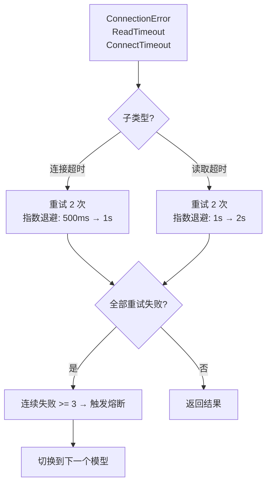
```mermaid
flowchart TD
    ERR_CONN["ConnectionError\nReadTimeout\nConnectTimeout"] --> CLASSIFY{"子类型?"}

    CLASSIFY -->|"连接超时"| RETRY_CONN["重试 2 次\n指数退避: 500ms → 1s"]
    CLASSIFY -->|"读取超时"| RETRY_READ["重试 2 次\n指数退避: 1s → 2s"]

    RETRY_CONN --> ALL_FAIL{"全部重试失败?"}
    RETRY_READ --> ALL_FAIL

    ALL_FAIL -->|"是"| TRIP["连续失败 >= 3 → 触发熔断"]
    ALL_FAIL -->|"否"| DONE["返回结果"]

    TRIP --> SWITCH["切换到下一个模型"]
```

---

## 10. 可观测性设计

### 10.1 Prometheus 指标

```yaml
# 熔断器状态
llm_circuit_breaker_state{model_id="gpt-4o"}       # 0=CLOSED, 1=OPEN, 2=HALF_OPEN
llm_circuit_breaker_failures_total{model_id="gpt-4o"}  # 累计失败次数
llm_circuit_breaker_trips_total{model_id="gpt-4o"}     # 累计熔断次数

# 请求指标
llm_request_total{model_id, status, error_type}        # 请求总数
llm_request_duration_seconds{model_id, status}          # 请求耗时分布
llm_request_tokens_total{model_id, type}                 # Token 使用量 (input/output)

# 降级指标
llm_fallback_total{from_model, to_model, reason}        # 降级次数
llm_fallback_duration_seconds                           # 降级切换耗时

# 速率限制
llm_rate_limit_hits_total{model_id}                     # 速率限制命中次数
llm_probe_queue_size{model_id}                          # 探针队列长度

# 探针指标
llm_probe_total{model_id, result}                       # 探针请求总数
llm_probe_duration_seconds{model_id}                     # 探针耗时

# 模型可用性
llm_model_available{model_id}                           # 0=不可用, 1=可用
llm_active_models_total                                 # 当前可用模型总数
```

### 10.2 Grafana 大盘布局

```
┌─────────────────────────────────────────────────────────────────┐
│  LLM 降级熔断监控大盘                              [30s 刷新]    │
├────────────────────────────┬────────────────────────────────────┤
│                            │                                    │
│  模型可用性状态            │  请求量 & 成功率                    │
│  ┌──────────────────────┐ │  ┌────────────────────────────────┐ │
│  │ GPT-4o     ● CLOSED  │ │  │  请求量 (QPS)                  │ │
│  │ Sonnet     ● CLOSED  │ │  │  ████████████ 120/s           │ │
│  │ DeepSeek   ◉ OPEN    │ │  │                                │ │
│  │ Qwen-Max   ● CLOSED  │ │  │  成功率 (%)                    │ │
│  └──────────────────────┘ │  │  █████████████████ 99.7%       │ │
│                            │  └────────────────────────────────┘ │
├────────────────────────────┼────────────────────────────────────┤
│                            │                                    │
│  降级事件时间线            │  错误类型分布                       │
│  ┌──────────────────────┐ │  ┌────────────────────────────────┐ │
│  │ 14:30 GPT-4o → OPEN  │ │  │  RATE_LIMIT     ████████ 45%  │ │
│  │ 14:30 → Sonnet       │ │  │  SERVER_OVERLOAD ███ 15%      │ │
│  │ 14:31 GPT-4o → HALF  │ │  │  CONN_ERROR     ██ 10%       │ │
│  │ 14:31 GPT-4o → CLOSED│ │  │  CONTENT_SAFETY ██ 10%       │ │
│  │ 14:52 DeepSeek→OPEN  │ │  │  AUTH_ERROR     █ 5%         │ │
│  └──────────────────────┘ │  │  OTHER          ██ 15%        │ │
│                            │  └────────────────────────────────┘ │
├────────────────────────────┴────────────────────────────────────┤
│  探针队列状态                                                    │
│  ┌────────────────────────────────────────────────────────────┐ │
│  │ GPT-4o: [████████] 8 probes queued  | 平均恢复时间: 12s    │ │
│  │ Sonnet: [█] 1 probe queued           | 平均恢复时间: 5s     │ │
│  └────────────────────────────────────────────────────────────┘ │
└─────────────────────────────────────────────────────────────────┘
```

### 10.3 告警规则

```yaml
alerts:
  - name: "模型熔断"
    condition: llm_circuit_breaker_state == 1
    for: 10s
    severity: warning
    message: "模型 {{ $labels.model_id }} 已熔断"

  - name: "所有主力模型不可用"
    condition: sum(llm_model_available{tier="primary"}) == 0
    for: 30s
    severity: critical
    message: "所有主力模型已不可用，系统运行在降级模式"

  - name: "所有模型不可用"
    condition: sum(llm_model_available) == 0
    for: 10s
    severity: critical
    message: "所有模型不可用，RAG 系统完全中断"

  - name: "降级频率过高"
    condition: rate(llm_fallback_total[5m]) > 10
    severity: warning
    message: "降级频率异常，5 分钟内降级 {{ $value }} 次"

  - name: "探针队列堆积"
    condition: llm_probe_queue_size > 20
    for: 1m
    severity: warning
    message: "{{ $labels.model_id }} 探针队列堆积，当前 {{ $value }} 个待处理"

  - name: "配额即将耗尽"
    condition: llm_quota_remaining_percent < 10
    severity: critical
    message: "{{ $labels.model_id }} 配额不足 10%，请立即充值"
```

---

## 11. Kubernetes 部署架构

### 11.1 整体部署拓扑

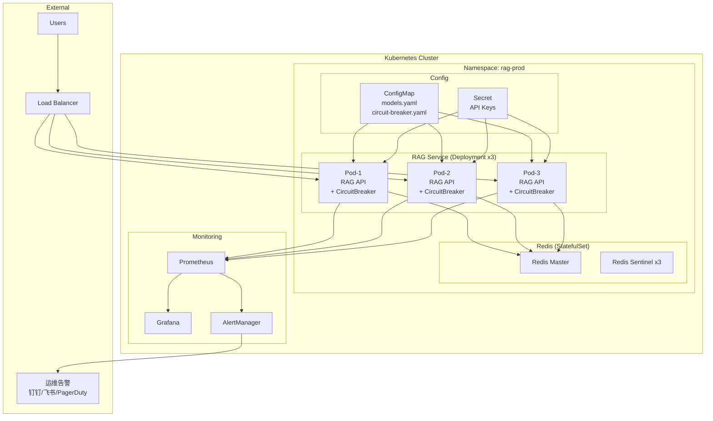
```mermaid
flowchart TB
    subgraph "Kubernetes Cluster"
        subgraph "Namespace: rag-prod"
            subgraph "RAG Service (Deployment x3)"
                P1["Pod-1\nRAG API\n+ CircuitBreaker"]
                P2["Pod-2\nRAG API\n+ CircuitBreaker"]
                P3["Pod-3\nRAG API\n+ CircuitBreaker"]
            end

            subgraph "Redis (StatefulSet)"
                REDIS_MASTER["Redis Master"]
                REDIS_SENTINEL["Redis Sentinel x3"]
            end

            subgraph "Config"
                CM["ConfigMap\nmodels.yaml\ncircuit-breaker.yaml"]
                SECRET["Secret\nAPI Keys"]
            end
        end

        subgraph "Monitoring"
            PROM["Prometheus"]
            GRAFANA["Grafana"]
            ALERTMANAGER["AlertManager"]
        end
    end

    subgraph "External"
        LB["Load Balancer"]
        USERS["Users"]
        OPS["运维告警\n钉钉/飞书/PagerDuty"]
    end

    USERS --> LB
    LB --> P1
    LB --> P2
    LB --> P3

    P1 --> REDIS_MASTER
    P2 --> REDIS_MASTER
    P3 --> REDIS_MASTER

    CM --> P1
    CM --> P2
    CM --> P3
    SECRET --> P1
    SECRET --> P2
    SECRET --> P3

    P1 --> PROM
    P2 --> PROM
    P3 --> PROM
    PROM --> GRAFANA
    PROM --> ALERTMANAGER
    ALERTMANAGER --> OPS
```

### 11.2 就绪探针与健康检查

```yaml
# Kubernetes 就绪探针 — 集成熔断器状态
readinessProbe:
  httpGet:
    path: /health/ready
    port: 8080
  initialDelaySeconds: 5
  periodSeconds: 10
  failureThreshold: 3

# /health/ready 端点逻辑:
# - 检查 Redis 连接
# - 检查至少 1 个模型处于 CLOSED 或 HALF_OPEN 状态
# - 如果所有模型 OPEN → 返回 503
# - 如果无可用模型但 Redis 正常 → 返回 503 (让 K8s 摘除流量)

livenessProbe:
  httpGet:
    path: /health/live
    port: 8080
  initialDelaySeconds: 15
  periodSeconds: 20
```

### 11.3 配置热更新

```yaml
# 模型配置通过 ConfigMap 挂载，支持热更新
apiVersion: v1
kind: ConfigMap
metadata:
  name: llm-models-config
data:
  models.yaml: |
    # ... 模型配置 ...
  circuit-breaker.yaml: |
    # ... 熔断器参数 ...
---
# 文件变更监听 (inotify / watch)
# Pod 内 sidecar 进程监听 ConfigMap 挂载文件变化
# 检测到变化 → 调用 ModelRegistry.reload() → 热更新模型列表
```

### 11.4 优雅关闭

```mermaid
flowchart LR
    SIGTERM["收到 SIGTERM"] --> DEREG["从 Service 摘除\n(就绪探针失败)"]
    DEREG --> DRAIN["排空进行中的请求\n(最长 30s)"]
    DRAIN --> FLUSH["刷新熔断器状态到 Redis\n(确保一致性)"]
    FLUSH --> CLOSE["关闭 Redis 连接"]
    CLOSE --> EXIT["退出"]
```

---

## 12. 配置示例

### 12.1 全局配置

```yaml
# config/circuit-breaker.yaml
circuit_breaker:
  defaults:
    failure_threshold: 3
    success_threshold: 2
    timeout_seconds: 60
    half_open_max_requests: 1
    recovery_timeout_seconds: 30

  # 按模型组覆盖
  tier_overrides:
    primary:
      failure_threshold: 3
      recovery_timeout_seconds: 30
    secondary:
      failure_threshold: 3
      recovery_timeout_seconds: 45
    fallback:
      failure_threshold: 5
      recovery_timeout_seconds: 60

probe:
  interval_initial_seconds: 5
  interval_max_seconds: 60
  interval_multiplier: 2.0
  prompt: "Respond with 'OK' and nothing else."
  max_tokens: 10
  timeout_seconds: 10

rate_limit:
  window_size_seconds: 60
  probe_backoff_base_ms: 1000
  probe_backoff_max_ms: 30000

concurrency:
  # 并发限制本地重试
  local_retry_max: 3
  local_retry_jitter_ms: 500
  # Redis 分布式信号量 (自动启用阈值)
  distributed_semaphore_enabled: false
  distributed_semaphore_auto_enable_threshold: 0.05  # 并发 429 比例 > 5% 自动启用
  # 信号量等待
  semaphore_wait_base_ms: 50
  semaphore_wait_max_ms: 1000
  semaphore_wait_multiplier: 2.0
  # 信号量 TTL (防止崩溃泄漏)
  semaphore_ttl_seconds: 60

retry:
  defaults:
    max_retries: 2
    backoff_base_ms: 500
    backoff_multiplier: 2.0

  error_overrides:
    RATE_LIMIT:
      max_retries: 0          # 不重试，直接切换
    SERVER_OVERLOAD:
      max_retries: 3
      backoff_base_ms: 1000
    CONNECTION_ERROR:
      max_retries: 2
      backoff_base_ms: 500
    CONTEXT_OVERFLOW:
      max_retries: 1
      compact_before_retry: true

redis:
  key_prefix: "llm:"
  lock_ttl_seconds: 5
  state_ttl_seconds: 300
  connection:
    host: "redis-sentinel.rag-prod.svc.cluster.local"
    port: 26379
    master_name: "mymaster"
    max_connections: 50
    socket_timeout_seconds: 2

alerts:
  webhook_url: "https://hooks.dingtalk.com/xxx"
  critical_models:
    - "gpt-4o"
    - "claude-sonnet-4"
  alert_on_errors:
    - "AUTH_ERROR"
    - "QUOTA_EXHAUSTED"
    - "TOKEN_EXPIRED"
    - "MODEL_UNAVAILABLE"
```

### 12.2 环境变量

```bash
# 模型 API Keys (通过 Kubernetes Secret 注入)
OPENAI_API_KEY=sk-xxx
ANTHROPIC_API_KEY=sk-ant-xxx
DASHSCOPE_API_KEY=sk-xxx
DEEPSEEK_API_KEY=sk-xxx

# Redis 连接
REDIS_URL=redis://redis-sentinel.rag-prod:26379

# 熔断器
CIRCUIT_BREAKER_ENABLED=true
CIRCUIT_BREAKER_CONFIG_PATH=/etc/rag/circuit-breaker.yaml

# 探测
PROBE_ENABLED=true
PROBE_INTERVAL_INITIAL_MS=5000

# 可观测性
PROMETHEUS_PORT=9090
METRICS_ENABLED=true
DEBUG_LOGGING=false
```

---

## 附录 A：核心类设计概要

> 以下为类接口设计，不包含实现代码。

```
ModelRouter (入口门面)
├── register(config: ModelConfig) -> None
├── invoke(prompt, constraints) -> LLMResult
├── get_available_models() -> List[ModelInfo]
└── health_check() -> HealthStatus

ModelRegistry (模型注册表)
├── load_config(path: str) -> None
├── reload() -> None
├── get_candidates(constraints: ModelConstraints) -> List[ModelInfo]
├── mark_unavailable(model_id: str, reason: str) -> None
└── get_model_info(model_id: str) -> ModelInfo

CircuitBreakerManager (分布式熔断器)
├── get_state(model_id: str) -> CircuitState
├── on_success(model_id: str) -> None
├── on_failure(model_id: str, error_type: ErrorType) -> None
├── is_available(model_id: str) -> bool
└── get_stats(model_id: str) -> BreakerStats

ErrorClassifier (错误分类器)
├── classify(error: Exception) -> ClassifiedError
├── get_strategy(error_type: ErrorType) -> ErrorStrategy
└── is_retryable(error_type: ErrorType) -> bool

FallbackEngine (降级引擎)
├── get_next_model(exclude: List[str], constraints) -> ModelInfo
├── should_retry(model_id, error_type, attempt) -> bool
└── get_retry_delay(model_id, error_type, attempt) -> float

ProbeScheduler (探针调度器)
├── schedule_probe(model_id: str, error_type: ErrorType) -> None
├── run_probe(model_id: str) -> ProbeResult
├── handle_probe_result(model_id, result) -> None
└── get_probe_queue_size(model_id: str) -> int

RateLimitHandler (速率限制处理)
├── check_rate_limit(model_id: str) -> bool
├── add_to_probe_queue(model_id: str, retry_after: float) -> None
├── process_probe_queue() -> None
└── adjust_rate(model_id: str, factor: float) -> None
```

---

## 附录 B：项目目录结构

```
rag-llm-resilience/
├── config/
│   ├── models.yaml              # 模型注册配置
│   ├── circuit-breaker.yaml     # 熔断器参数
│   └── alerts.yaml              # 告警规则
├── src/
│   ├── router/
│   │   ├── model_router.py      # 入口门面
│   │   ├── model_registry.py    # 模型注册表
│   │   └── fallback_engine.py   # 降级引擎
│   ├── circuit_breaker/
│   │   ├── breaker_manager.py   # 分布式熔断器管理器
│   │   ├── breaker_state.py     # 状态机逻辑
│   │   └── redis_store.py       # Redis 状态存储
│   ├── error/
│   │   ├── classifier.py        # 错误分类器
│   │   ├── error_types.py       # 错误类型枚举
│   │   └── strategies.py        # 各错误处理策略
│   ├── probe/
│   │   ├── scheduler.py         # 探针调度器
│   │   └── rate_limit_probe.py  # 速率限制探针
│   ├── rate_limit/
│   │   ├── handler.py           # 速率限制处理器
│   │   └── sliding_window.py    # 滑动窗口实现
│   ├── metrics/
│   │   ├── prometheus.py        # Prometheus 指标
│   │   └── events.py            # 事件日志
│   └── health/
│       └── checks.py            # 健康检查端点
├── deploy/
│   ├── kubernetes/
│   │   ├── deployment.yaml
│   │   ├── configmap.yaml
│   │   ├── secret.yaml
│   │   └── servicemonitor.yaml
│   └── docker/
│       └── Dockerfile
├── tests/
│   ├── test_circuit_breaker.py
│   ├── test_fallback_engine.py
│   ├── test_error_classifier.py
│   └── integration/
│       └── test_e2e_failover.py
└── README.md
```

---

*本方案为纯设计文档，定义了生产态 RAG 系统 LLM 降级熔断的完整架构、策略和运维方案。*