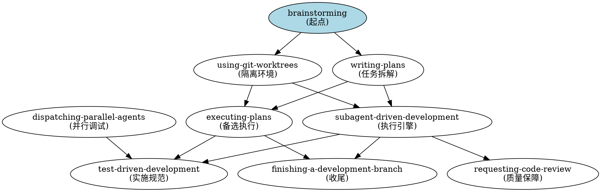

# Superpowers 源码解读报告

> **项目地址**: https://github.com/obra/superpowers  
> **作者**: Jesse Vincent (Prime Radiant)  
> **版本**: 5.0.7  
> **许可证**: MIT  
> **解读日期**: 2026-04-12

---

## 一、项目概述

### 1.1 什么是 Superpowers

Superpowers 是一套**完整的 AI 编码代理开发工作流系统**，基于可组合的 "技能"(Skills) 构建。它不是简单的工具集合，而是一套**强制性的开发规范**，确保 AI 代理按照经过验证的最佳实践进行软件开发。

**核心定位**: 让 AI 代理从"代码生成器"转变为"系统化开发者"

### 1.2 解决的问题

| 问题 | Superpowers 方案 |
|------|-----------------|
| AI 直接写代码，不思考需求 | 强制先做设计 (brainstorming) |
| 代码无测试或测试后写 | 强制 TDD (测试驱动开发) |
| 任务太大，AI 迷失方向 | 拆解为 2-5 分钟的小任务 |
| 代码质量不稳定 | 双阶段审查 (规范 + 质量) |
| 多人/多代理协作混乱 | Git Worktree 隔离 + 审查流程 |
| AI 跳过关键步骤 | 技能强制触发，非可选建议 |

### 1.3 核心哲学

```
✅ 测试驱动开发 (TDD) - 先写测试，永远
✅ 系统化胜于临时发挥 - 流程胜于猜测
✅ 复杂度降低 - 简洁是首要目标
✅ 证据胜于声明 - 验证后再宣布成功
```

---

## 二、架构设计

### 2.1 整体架构图

```
┌─────────────────────────────────────────────────────────────────┐
│                        用户需求输入                              │
└─────────────────────────────────────────────────────────────────┘
                              │
                              ▼
┌─────────────────────────────────────────────────────────────────┐
│  1. BRAINSTORMING (头脑风暴)                                     │
│     - 探索项目上下文                                              │
│     - 提问澄清需求 (一次一个)                                      │
│     - 提出 2-3 种方案及权衡                                        │
│     - 分章节呈现设计，逐章确认                                     │
│     - 保存设计文档到 docs/superpowers/specs/                      │
└─────────────────────────────────────────────────────────────────┘
                              │
                              ▼
┌─────────────────────────────────────────────────────────────────┐
│  2. USING-GIT-WORKTREES (隔离工作区)                             │
│     - 检测/创建工作树目录 (.worktrees/ 优先)                       │
│     - 验证目录被.gitignore 忽略                                    │
│     - 创建独立分支的工作树                                         │
│     - 运行项目安装 (npm install/cargo build 等)                    │
│     - 验证测试基线干净                                             │
└─────────────────────────────────────────────────────────────────┘
                              │
                              ▼
┌─────────────────────────────────────────────────────────────────┐
│  3. WRITING-PLANS (编写实施计划)                                  │
│     - 拆解为 bite-sized 任务 (每个 2-5 分钟)                        │
│     - 每个任务包含：精确文件路径、完整代码、测试命令、提交步骤      │
│     - 禁止占位符 (TBD/TODO/类似的)                                 │
│     - 保存计划到 docs/superpowers/plans/                          │
└─────────────────────────────────────────────────────────────────┘
                              │
                              ▼
┌─────────────────────────────────────────────────────────────────┐
│  4. 执行计划 (二选一)                                             │
│  ┌─────────────────────┐    ┌─────────────────────────────────┐ │
│  │ SUBAGENT-DRIVEN     │    │ EXECUTING-PLANS                 │ │
│  │ DEVELOPMENT         │    │                                 │ │
│  │ (推荐)              │    │ (并行会话)                        │ │
│  │                     │    │                                 │ │
│  │ • 每任务新子代理      │    │ • 批量执行 + 人类检查点     │ │
│  │ • 双阶段审查         │    │ • 人类检查点                      │ │
│  │   - 规范合规性审查    │    │ • 适合跨会话协作                  │ │
│  │   - 代码质量审查     │    │                                 │ │
│  │ • 同会话快速迭代     │    │                                 │ │
│  └─────────────────────┘    └─────────────────────────────────┘ │
└─────────────────────────────────────────────────────────────────┘
                              │
                              ▼
┌─────────────────────────────────────────────────────────────────┐
│  5. 每个任务执行流程                                              │
│  ┌──────────────────────────────────────────────────────────┐   │
│  │ 实现子代理 → 规范审查子代理 → 质量审查子代理 → 循环修复    │   │
│  └──────────────────────────────────────────────────────────┘   │
└─────────────────────────────────────────────────────────────────┘
                              │
                              ▼
┌─────────────────────────────────────────────────────────────────┐
│  6. FINISHING-A-DEVELOPMENT-BRANCH (完成开发分支)                │
│     - 验证所有测试通过                                            │
│     - 呈现 4 个选项：合并/PR/保留/丢弃                              │
│     - 执行选择的操作                                              │
│     - 清理工作树 (如适用)                                         │
└─────────────────────────────────────────────────────────────────┘
```

### 2.2 技能依赖关系图



### 2.3 目录结构解析

```
superpowers/
├── skills/                          # 核心技能库
│   ├── brainstorming/               # 需求分析与设计
│   │   ├── SKILL.md                 # 技能说明
│   │   └── visual-companion.md      # 视觉辅助指南
│   ├── writing-plans/               # 计划编写
│   ├── subagent-driven-development/ # 子代理驱动开发
│   │   ├── SKILL.md
│   │   ├── implementer-prompt.md    # 实现者提示模板
│   │   ├── spec-reviewer-prompt.md  # 规范审查提示
│   │   └── code-quality-reviewer-prompt.md  # 质量审查提示
│   ├── executing-plans/             # 计划执行 (批量)
│   ├── test-driven-development/     # TDD 强制规范
│   ├── using-git-worktrees/         # Git 工作树管理
│   ├── requesting-code-review/      # 代码审查请求
│   ├── receiving-code-review/       # 接收审查反馈
│   ├── finishing-a-development-branch/  # 分支收尾
│   ├── dispatching-parallel-agents/ # 并行代理调度
│   ├── systematic-debugging/        # 系统化调试
│   ├── verification-before-completion/  # 完成前验证
│   └── writing-skills/              # 创建新技能
│
├── agents/                          # 专用代理配置
│   └── code-reviewer.md             # 代码审查代理模板
│
├── commands/                        # 命令定义
│   ├── brainstorm.md
│   ├── write-plan.md
│   └── execute-plan.md
│
├── docs/                            # 文档
│   ├── plans/                       # 计划示例
│   ├── superpowers/                 # 使用说明
│   ├── README.codex.md              # Codex 安装指南
│   └── README.opencode.md           # OpenCode 安装指南
│
├── .github/                         # GitHub 配置
│   └── PULL_REQUEST_TEMPLATE.md     # PR 模板 (严格)
│
├── AGENTS.md                        # 贡献者指南 (AI 必读)
├── CLAUDE.md                        # 项目上下文
├── README.md                        # 项目说明
└── package.json                     # 包配置
```

---

## 三、核心技能详解

### 3.1 Brainstorming (头脑风暴)

**触发条件**: 任何创造性工作之前 (功能创建、组件构建、添加功能、修改行为)

**核心规则**: 
```
<HARD-GATE>
在呈现设计并获得用户批准之前，禁止执行任何实施技能、编写任何代码、
搭建任何项目或采取任何实施行动。这适用于每个项目，无论感知多么简单。
</HARD-GATE>
```

**工作流程**:
1. 探索项目上下文 (文件、文档、最近提交)
2. 如有视觉问题，提供视觉辅助 (独立消息)
3. 逐个提问澄清 (一次一个问题)
4. 提出 2-3 种方案及权衡
5. 分章节呈现设计，每章后确认
6. 编写设计文档 → `docs/superpowers/specs/YYYY-MM-DD-<topic>-design.md`
7. 规范自检 (占位符、一致性、范围、歧义)
8. 用户审查书面规范
9. 调用 writing-plans 技能

**反模式**: "这太简单了不需要设计"
- 待办清单、单函数工具、配置更改 — 全部需要
- "简单"项目是未检验假设造成最多浪费的地方
- 设计可以简短 (真正简单的项目几句话)，但必须呈现并获得批准

**设计原则**:
- 将系统拆分为更小单元，每个单元有单一清晰目的
- 通过明确定义的接口通信
- 可独立理解和测试
- 每个单元应能回答：做什么、如何使用、依赖什么

### 3.2 Writing-Plans (编写计划)

**触发条件**: 拥有多步骤任务的规范或需求后，接触代码之前

**核心原则**: 假设工程师对代码库零上下文且品味可疑

**计划文档头部 (必须)**:
```markdown
# [功能名称] 实施计划

> **对于代理工作者**: 必需子技能 - 使用 superpowers:subagent-driven-development
> (推荐) 或 superpowers:executing-plans 逐任务实施此计划。步骤使用复选框语法。

**目标**: [一句话描述构建内容]

**架构**: [2-3 句关于方法]

**技术栈**: [关键技术/库]

---
```

**任务粒度**: 每个步骤是一个动作 (2-5 分钟)
- "编写失败测试" - 步骤
- "运行确保失败" - 步骤
- "实施最小代码使其通过" - 步骤
- "运行测试确保通过" - 步骤
- "提交" - 步骤

**禁止占位符** (计划失败标志):
- ❌ "TBD", "TODO", "稍后实现", "填写细节"
- ❌ "添加适当的错误处理" / "添加验证" / "处理边缘情况"
- ❌ "为上述编写测试" (无实际测试代码)
- ❌ "类似于任务 N" (重复代码 — 工程师可能乱序阅读任务)
- ❌ 描述做什么但不展示怎么做 (代码步骤需要代码块)

**任务结构示例**:
```markdown
### 任务 N: [组件名称]

**文件**:
- 创建：`exact/path/to/file.py`
- 修改：`exact/path/to/existing.py:123-145`
- 测试：`tests/exact/path/to/test.py`

- [ ] **步骤 1: 编写失败测试**
```python
def test_specific_behavior():
    result = function(input)
    assert result == expected
```

- [ ] **步骤 2: 运行测试验证失败**
运行：`pytest tests/path/test.py::test_name -v`
预期：FAIL with "function not defined"

- [ ] **步骤 3: 编写最小实现**
```python
def function(input):
    return expected
```

- [ ] **步骤 4: 运行测试验证通过**
运行：`pytest tests/path/test.py::test_name -v`
预期：PASS

- [ ] **步骤 5: 提交**
```bash
git add tests/path/test.py src/path/file.py
git commit -m "feat: add specific feature"
```
```

### 3.3 Subagent-Driven Development (子代理驱动开发)

**触发条件**: 在当前会话中执行包含独立任务的实施计划

**核心原理**: 每个任务新子代理 + 双阶段审查 (先规范后质量) = 高质量、快速迭代

**为什么使用子代理**:
- 委托任务给具有隔离上下文的专用代理
- 精确构建指令和上下文，确保专注和成功
- 永不继承会话上下文或历史
- 保留自身上下文用于协调工作

**执行流程**:
```
读取计划 → 提取所有任务 → 创建 TodoWrite
    │
    ▼
┌─────────────────────────────────────────────┐
│ 对每个任务循环:                              │
│                                             │
│ 1. 调度实现子代理 (implementer-prompt.md)     │
│    - 提供完整任务文本 + 上下文                │
│    - 实现子代理可能提问 → 回答 → 重新调度      │
│    - 实施、测试、提交、自检                   │
│                                             │
│ 2. 调度规范审查子代理 (spec-reviewer-prompt.md)│
│    - 确认代码符合规范？                       │
│    - 否 → 实现子代理修复 → 重新审查            │
│    - 是 → 进入质量审查                        │
│                                             │
│ 3. 调度代码质量审查子代理                      │
│    - 批准？                                   │
│    - 否 → 实现子代理修复 → 重新审查            │
│    - 是 → 标记任务完成                        │
│                                             │
└─────────────────────────────────────────────┘
    │
    ▼
所有任务完成 → 最终代码审查 → finishing-a-development-branch
```

**模型选择策略**:
| 任务类型 | 模型选择 |
|---------|---------|
| 机械实施任务 (1-2 文件，清晰规范) | 快速、廉价模型 |
| 集成和判断任务 (多文件协调) | 标准模型 |
| 架构、设计和审查任务 | 最强可用模型 |

**实现子代理状态处理**:
- **DONE**: 进入规范审查
- **DONE_WITH_CONCERNS**: 阅读关切，如关于正确性/范围则先解决
- **NEEDS_CONTEXT**: 提供缺失上下文并重新调度
- **BLOCKED**: 评估阻塞原因，可能升级至人类

### 3.4 Test-Driven Development (测试驱动开发)

**核心原则**: 
```
NO PRODUCTION CODE WITHOUT A FAILING TEST FIRST
没有失败测试先行，禁止生产代码
```

**铁律**: 如果先写了代码，删除它。从头开始。

**红 - 绿 - 重构循环**:
```
RED (红) → 编写失败测试
    │
    ▼
验证失败 ✓
    │
    ▼
GREEN (绿) → 最小实现代码
    │
    ▼
验证通过 ✓
    │
    ▼
REFACTOR (重构) → 清理代码
    │
    ▼
重复下一测试
```

**RED 阶段要求**:
- 一个行为
- 清晰的测试名称
- 真实代码 (除非不可避免不用 mock)

**验证 RED (强制，永不跳过)**:
- 测试失败 (不是错误)
- 失败信息符合预期
- 因功能缺失而失败 (不是拼写错误)

**GREEN 阶段**:
- 编写最简单的代码通过测试
- 不添加功能、不重构其他代码、不"改进"超出测试范围

**常见借口与现实**:
| 借口 | 现实 |
|------|------|
| "太简单了不用测试" | 简单代码也会坏。测试只需 30 秒。 |
| "我稍后写测试" | 立即通过的测试证明不了什么。 |
| "已经手动测试所有边缘情况" | 临时 ≠ 系统化。无记录，无法重跑。 |
| "删除 X 小时工作是浪费" | 沉没成本谬误。保留无法信任的代码才是技术债。 |
| "TDD 是教条，我务实" | TDD 就是务实：调试生产更慢。 |

**红旗标志 **(停止并重来):
- 代码先于测试
- 测试在实现之后
- 测试立即通过
- 无法解释测试为何失败
- "就这一次"的合理化

### 3.5 Using-Git-Worktrees (使用 Git 工作树)

**触发条件**: 开始需要与当前工作区隔离的功能工作，或执行实施计划前

**核心原理**: 系统化目录选择 + 安全验证 = 可靠隔离

**目录选择优先级**:
1. 检查现有目录
   - `.worktrees/` (首选，隐藏)
   - `worktrees/` (备选)
   - 如两者都存在，`.worktrees/` 胜出
2. 检查 CLAUDE.md 中的用户偏好
3. 询问用户

**安全验证 **(项目本地目录必须):
```bash
git check-ignore -q .worktrees 2>/dev/null || git check-ignore -q worktrees 2>/dev/null
```

**如未忽略**:
1. 添加适当行到 .gitignore
2. 提交更改
3. 继续创建工作树

**创建步骤**:
1. 检测项目名称
2. 创建工作树 + 新分支
3. 运行项目安装 (npm install/cargo build 等)
4. 验证干净测试基线
5. 报告位置

### 3.6 Requesting-Code-Review (请求代码审查)

**核心原则**: 尽早审查，频繁审查

**强制审查时机**:
- 子代理驱动开发中每个任务后
- 完成主要功能后
- 合并到 main 之前

**审查流程**:
1. 获取 git SHAs
   ```bash
   BASE_SHA=$(git rev-parse HEAD~1)
   HEAD_SHA=$(git rev-parse HEAD)
   ```
2. 调度 code-reviewer 子代理
3. 根据反馈行动
   - Critical 问题：立即修复
   - Important 问题：继续前修复
   - Minor 问题：记录稍后处理

### 3.7 Finishing-a-Development-Branch (完成开发分支)

**触发条件**: 实施完成，所有测试通过，需要决定如何集成的工作

**流程**:
1. 验证测试通过
2. 确定基础分支
3. 呈现 4 个选项:
   ```
   实施完成。你想做什么？
   
   1. 本地合并回 <base-branch>
   2. 推送并创建 Pull Request
   3. 保持分支原样 (我稍后处理)
   4. 丢弃此工作
   
   哪个选项？
   ```
4. 执行选择
5. 清理工作树 (选项 1、2、4)

---

## 四、大型多人协同开发使用指南

### 4.1 团队角色定义

> **注**: 以下角色定义基于各技能文档中描述的职责**推断**而成，源码中无明确角色定义表格。

在多人协同场景中，Superpowers 定义了清晰的角色分工:

| 角色 | 职责 | 使用技能 |
|------|------|---------|
| **产品负责人** | 需求澄清、设计审批 | brainstorming |
| **架构师** | 技术方案选择、架构审查 | brainstorming + requesting-code-review |
| **开发代理** | 任务实施 | subagent-driven-development + tdd |
| **审查代理** | 规范合规性、代码质量 | requesting-code-review |
| **集成负责人** | 合并决策、分支管理 | finishing-a-development-branch |

### 4.2 协同开发工作流

> **注**: 以下工作流为**基于各技能流程组合的推断**，非原文明确陈述。

```
┌─────────────────────────────────────────────────────────────────────┐
│ 阶段 1: 需求与设计 (人类 + AI)                                        │
├─────────────────────────────────────────────────────────────────────┤
│ 1. 人类提出需求                                                      │
│ 2. AI 启动 brainstorming 技能                                         │
│ 3. AI 逐个提问澄清 (人类回答)                                          │
│ 4. AI 提出 2-3 种方案及权衡                                            │
│ 5. 人类 + AI 讨论选择最佳方案                                          │
│ 6. AI 分章节呈现设计，人类逐章确认                                     │
│ 7. AI 编写设计文档并保存                                              │
│ 8. 人类审查设计文档                                                   │
│ 9. 人类批准 → 进入下一阶段                                             │
└─────────────────────────────────────────────────────────────────────┘
                              │
                              ▼
┌─────────────────────────────────────────────────────────────────────┐
│ 阶段 2: 环境准备 (AI 自动)                                            │
├─────────────────────────────────────────────────────────────────────┤
│ 1. AI 启动 using-git-worktrees 技能                                    │
│ 2. AI 检测/创建工作树目录                                             │
│ 3. AI 验证.gitignore 配置                                              │
│ 4. AI 创建独立分支的工作树                                             │
│ 5. AI 运行项目安装                                                    │
│ 6. AI 验证测试基线干净                                                │
│ 7. AI 报告准备就绪                                                    │
└─────────────────────────────────────────────────────────────────────┘
                              │
                              ▼
┌─────────────────────────────────────────────────────────────────────┐
│ 阶段 3: 计划编写 (AI + 人类审查)                                       │
├─────────────────────────────────────────────────────────────────────┤
│ 1. AI 启动 writing-plans 技能                                          │
│ 2. AI 拆解为 bite-sized 任务 (每个 2-5 分钟)                            │
│ 3. AI 为每个任务编写：文件路径、完整代码、测试命令、提交步骤             │
│ 4. AI 自检计划 (占位符、一致性、范围)                                   │
│ 5. 人类审查计划文档                                                   │
│ 6. 人类批准 → 进入执行阶段                                             │
└─────────────────────────────────────────────────────────────────────┘
                              │
                              ▼
┌─────────────────────────────────────────────────────────────────────┐
│ 阶段 4: 任务执行 (AI 自动，人类可选监督)                                 │
├─────────────────────────────────────────────────────────────────────┤
│ 对每个任务循环:                                                       │
│                                                                     │
│ 1. AI 调度实现子代理 (提供完整任务文本 + 上下文)                         │
│ 2. 实现子代理实施、测试、提交、自检                                    │
│ 3. AI 调度规范审查子代理                                               │
│    - 符合规范？否 → 修复 → 重审                                       │
│ 4. AI 调度代码质量审查子代理                                           │
│    - 批准？否 → 修复 → 重审                                           │
│ 5. 标记任务完成                                                       │
│                                                                     │
│ 人类可选监督点:                                                       │
│ - 每个任务完成后可查看审查报告                                         │
│ - 遇到 BLOCKED 状态时介入                                             │
│ - 定期查看 TodoWrite 进度                                              │
└─────────────────────────────────────────────────────────────────────┘
                              │
                              ▼
┌─────────────────────────────────────────────────────────────────────┐
│ 阶段 5: 完成与集成 (人类决策 + AI 执行)                                  │
├─────────────────────────────────────────────────────────────────────┤
│ 1. AI 启动 finishing-a-development-branch 技能                         │
│ 2. AI 验证所有测试通过                                                │
│ 3. AI 呈现 4 个选项 (合并/PR/保留/丢弃)                                  │
│ 4. 人类选择选项                                                       │
│ 5. AI 执行选择的操作                                                  │
│ 6. AI 清理工作树 (如适用)                                             │
└─────────────────────────────────────────────────────────────────────┘
```

### 4.3 多人并行开发场景

> **注**: 以下场景为**基于 using-git-worktrees 和 dispatching-parallel-agents 技能功能的推断**。

**场景**: 5 人团队同时开发不同功能

```
主分支 (main)
    │
    ├── 工作树 A: 功能 X (开发者 A + AI)
    │   ├── brainstorming → 设计 X
    │   ├── using-git-worktrees → feature/x
    │   ├── writing-plans → 计划 X
    │   └── subagent-driven-development → 实施 X
    │
    ├── 工作树 B: 功能 Y (开发者 B + AI)
    │   ├── brainstorming → 设计 Y
    │   ├── using-git-worktrees → feature/y
    │   ├── writing-plans → 计划 Y
    │   └── subagent-driven-development → 实施 Y
    │
    ├── 工作树 C: Bug 修复 Z (开发者 C + AI)
    │   ├── using-git-worktrees → fix/z
    │   ├── writing-plans → 计划 Z
    │   └── subagent-driven-development → 实施 Z
    │
    └── ... (更多并行工作树)

完成时:
    - 每个工作树独立运行测试
    - 各自请求代码审查
    - 各自选择合并/PR
    - 互不干扰
```

**优势**:
- 每个功能在隔离环境中开发
- 测试基线独立验证
- 代码审查独立进行
- 合并冲突最小化

### 4.4 代码审查协作流程

> **注**: 以下流程为**基于 requesting-code-review 和 receiving-code-review 技能组合的推断**。

```
┌─────────────────────────────────────────────────────────────────────┐
│ 审查流程 (人类 + AI 协作)                                              │
├─────────────────────────────────────────────────────────────────────┤
│                                                                     │
│ 1. 开发者完成功能，测试通过                                            │
│                                                                     │
│ 2. AI 自动调度 code-reviewer 子代理                                    │
│    - 输入：实现内容、计划/需求、git SHAs                              │
│    - 输出：优势、问题 (按严重性)、评估                                 │
│                                                                     │
│ 3. 问题分类处理:                                                      │
│    ┌────────────┬────────────────────────────────────────────┐      │
│    │ 严重性      │ 处理方式                                    │      │
│    ├────────────┼────────────────────────────────────────────┤      │
│    │ Critical   │ 立即修复，审查通过前禁止继续                 │      │
│    │ Important  │ 继续前修复                                   │      │
│    │ Minor      │ 记录，稍后处理                               │      │
│    └────────────┴────────────────────────────────────────────┘      │
│                                                                     │
│ 4. 人类审查员可选介入:                                                │
│    - 查看 AI 审查报告                                                 │
│    - 添加额外审查意见                                                │
│    - 对 AI 审查结果提出异议 (附技术理由)                               │
│                                                                     │
│ 5. 修复循环:                                                          │
│    - 开发者/AI 修复问题                                               │
│    - 重新调度审查子代理                                              │
│    - 重复直到批准                                                    │
│                                                                     │
│ 6. 审查通过 → 进入合并/PR 流程                                         │
│                                                                     │
└─────────────────────────────────────────────────────────────────────┘
```

### 4.5 冲突解决策略

> **注**: 源码中无明确冲突解决流程，以下策略为**基于技能功能的推断**。

**预防优于解决**:
1. 使用 Git Worktrees 隔离开发
2. 频繁提交 (每个任务后)
3. 小任务粒度 (2-5 分钟)
4. 明确的文件责任划分

**冲突发生时**:
```
1. AI 检测冲突 (git merge 失败)
2. AI 报告冲突文件及原因
3. 人类决定解决策略:
   - 接受当前分支
   - 接受主分支
   - 手动合并
4. AI 执行解决
5. AI 运行测试验证解决正确
6. 继续合并流程
```

### 4.6 质量保证体系

> **注**: 以下体系为**基于各技能质量保障机制的综合推断**，非原文明确陈述。

```
┌─────────────────────────────────────────────────────────────────────┐
│ 多层质量保障                                                         │
├─────────────────────────────────────────────────────────────────────┤
│                                                                     │
│ 层级 1: TDD (测试驱动开发)                                            │
│ - 每个功能先写测试                                                   │
│ - 观看测试失败                                                       │
│ - 编写最小实现                                                       │
│ - 观看测试通过                                                       │
│                                                                     │
│ 层级 2: 子代理自检                                                    │
│ - 实现子代理完成后的自我审查                                          │
│ - 发现明显问题立即修复                                                │
│                                                                     │
│ 层级 3: 规范合规性审查                                                 │
│ - 专用审查子代理                                                     │
│ - 逐条对照计划/规范                                                   │
│ - 发现缺失或多余功能                                                  │
│                                                                     │
│ 层级 4: 代码质量审查                                                   │
│ - 专用审查子代理                                                     │
│ - 检查代码风格、架构、边缘情况                                         │
│ - 按严重性分类问题                                                    │
│                                                                     │
│ 层级 5: 人类审查 (可选但推荐)                                          │
│ - 查看 AI 审查报告                                                     │
│ - 添加额外意见                                                       │
│ - 最终批准                                                            │
│                                                                     │
│ 层级 6: 完成前验证                                                     │
│ - verification-before-completion 技能                                 │
│ - 确保真正修复而非表面通过                                             │
│                                                                     │
└─────────────────────────────────────────────────────────────────────┘
```

---

## 五、实践建议

### 5.1 团队落地步骤

> **注**: 以下步骤为**作者建议**，源码中无具体落地时间表。

**第 1 周：熟悉流程**
- 阅读所有技能文档
- 在个人项目上试用完整流程
- 记录不适应的环节

**第 2 周：小团队协作**
- 2-3 人小组试点
- 选择一个小型功能
- 完整走一遍 brainstorming → finishing 流程
- 每日站会讨论流程问题

**第 3-4 周：规模化**
- 扩展到全团队
- 建立团队规范 (如工作树目录位置、审查响应时间)
- 定制团队专属技能 (如团队特定的代码风格审查)

**第 2 个月：优化**
- 收集团队反馈
- 调整任务粒度
- 优化审查流程

### 5.2 常见问题解答

**Q: 流程太繁琐，简单功能也要走全套吗？**

A: 是的。"简单"项目是未检验假设造成最多浪费的地方。设计可以简短 (真正简单的项目几句话)，但必须呈现并获得批准。这是系统性思维与临时发挥的区别。

**Q: TDD 太慢了，能否跳过？**

A: 不能。TDD 的核心价值不是测试本身，而是"观看测试失败"这一验证过程。这证明测试真正测试了某些东西。30 分钟的测试后写 ≠ TDD。你得到覆盖率，失去证明测试有效的证据。

**Q: 子代理成本太高怎么办？**

A: 使用模型选择策略：
- 机械任务用廉价模型
- 集成任务用标准模型
- 审查任务用最强模型

早期多花的钱会在后期节省大量调试时间。

**Q: 人类审查员需要全程参与吗？**

A: 不需要。Superpowers 设计为 AI 自主运行数小时。人类介入点：
- 设计审批
- 计划审批
- 遇到 BLOCKED 状态
- 最终合并决策

中间执行过程 AI 自主完成。

**Q: 如何处理紧急 hotfix？**

A: 流程不变，但可简化：
- brainstorming: 简短设计 (几段话)
- writing-plans: 聚焦修复任务
- 执行：单任务快速完成
- 审查：仍需双阶段审查

流程是保障质量的，不是阻碍速度的。

### 5.3 团队规范建议

```markdown
## 团队 Superpowers 规范

### 工作树配置
- 目录位置：`.worktrees/` (项目本地)
- 命名规范：`<类型>/<描述>` (如 `feature/auth-login`)

### 审查响应时间
- Critical: 2 小时内响应
- Important: 24 小时内响应
- Minor: 下次迭代前处理

### 提交规范
- 每个任务后提交
- 提交信息格式：`<类型>: <描述>`
- 类型：feat/fix/docs/style/refactor/test/chore

### 分支策略
- 功能分支：`feature/<描述>`
- 修复分支：`fix/<描述>`
- 基础分支：`main`

### 会议节奏
- 每日站会：同步进度、阻塞
- 设计评审：需要时召开
- 回顾会议：每迭代一次
```

---

## 六、总结

### 6.1 核心价值

Superpowers 不是工具集合，而是**开发哲学编码化**:

1. **系统化胜于临时发挥** — 流程确保一致性
2. **证据胜于声明** — 测试证明而非声称
3. **简洁胜于复杂** — YAGNI  ruthlessly
4. **隔离胜于共享** — Worktree 避免冲突

### 6.2 适用场景

> **注**: 以下评估为**作者推断**，源码中无适用场景评估。

| 场景 | 适用度 | 说明 |
|------|--------|------|
| 大型多人协同项目 | ⭐⭐⭐⭐⭐ | 隔离开发 + 标准化流程 |
| 长期维护项目 | ⭐⭐⭐⭐⭐ | 测试保障 + 文档完整 |
| 快速原型 | ⭐⭐⭐ | 可简化设计阶段 |
| 个人项目 | ⭐⭐⭐⭐ | 培养良好习惯 |
| 紧急 hotfix | ⭐⭐⭐ | 流程简化但仍保障质量 |

### 6.3 学习曲线

```
熟练度
  │
  │                          ╭────────── 精通
  │                      ╭──╯
  │                  ╭──╯
  │              ╭──╯
  │          ╭──╯
  │      ╭──╯
  │  ╭──╯
  ╰──╰─────────────────────────────→ 时间
     1周  2周  1月  2月  3月

阶段:
- 第 1 周：理解流程，感觉繁琐
- 第 2 周：开始看到价值，减少抵触
- 第 1 月：流程内化，效率提升
- 第 2 月：自主优化，团队协同流畅
- 第 3 月：成为习惯，质量稳定
```

### 6.4 最终建议

**对个人**:
- 完整走一遍流程，即使个人项目
- 记录不适应的环节，思考原因
- 不要跳过"繁琐"步骤 — 它们存在有理由

**对团队**:
- 统一配置 (工作树目录、审查模板)
- 定期回顾流程效果
- 鼓励反馈，持续优化

**对管理者**:
- 理解前期投入与后期收益
- 支持团队度过学习曲线
- 用数据说话 (bug 率、返工率、交付时间)

---

> **记住**: Superpowers 的目标不是让 AI 写代码，而是让 AI 成为**系统化开发者**。代码是副产品，质量是目标，流程是保障。
